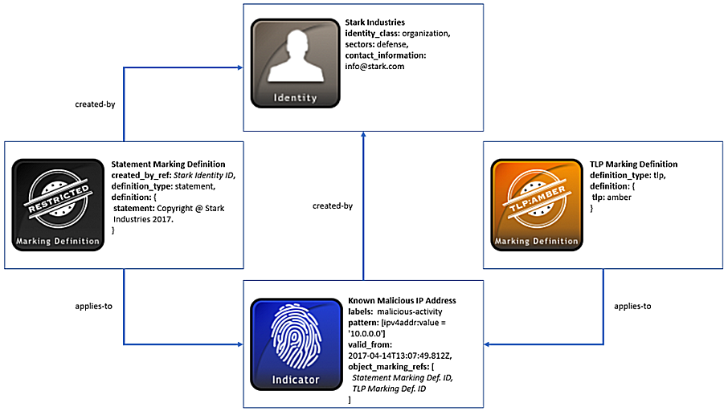

## 使用标记定义

能够通过使用数据标记来构建数据处理，对于共享网络威胁情报（CTI）的组织至关重要。这种方法的好处是允许STIX生产者限制对象的访问，并传达使用条款和版权信息【10】。

### 场景

此场景重点关注STIX生产者“Stark Industries”，其在攻击指标对象上添加对象标记。在共享此指标之前，Stark会创建一个“声明”标记定义并选择“交通灯协议”（TLP）标记定义。这些标记包含版权信息，另外，基于其TLP标记类型可限制攻击指标的使用。

### 数据模型

​	首先，我们从这个场景的STIX内容生产者Stark Industries开始。与该公司有关的信息可以使用身份SDO来表示。与所有STIX对象一样，**id**属性唯一标识**Stark Industries**，并且可以在生成的所有对象中使用**created_by_ref**属性来引用他们。虽然**created_by_ref**是可选的，但这有助于将创建的标签直接归属于**Stark**。身份对象也可用于列出有关Stark的其它相关详细信息，例如，**contact_information**和它们**identity_class**字段的身份类型。

​	接下来，Stark使用两个STIX标记定义对象来限制对攻击指标对象的处理，并且包含版权信息。首先，Stark选择TLP标记对象类型来为该攻击指标传达适当的限制。对于此标记定义对象，**definition_type**必须是**tlp**，并且**definition**（定义）字段必须包含TLP的四种类型之一。在本例中，TLP限制类型为**amber**，这仅向又需要知道的合适接收者提供有限的披露。要了解此限制和其他类型的TLP，请查看US-CERT的TLP定义和使用。

​	由Stark Industries创建的称为Statement的第二种标记类型，用于表示其版权信息并应用于它们生成的所有对象。这与TLP标记定义对象的格式类似，除了这种情况下**definition_type**必须是**statement**，并且存在**created_by_ref**字段，因为TLP已经在STIX 2.0规范中预先定义。**definition**（定义）字段包含你想传达的任何类型的版权信息。对于这个组织，它只是声明版权@ Stark Industries 2017。这个属性还可以传达任何使用条款，或者因为Statement允许多种标记类型，所以你可以同时使用这两个条款。

​	值得注意的一点是，标记定义对象不能像其他STIX对象那样进行版本化。例如，如果Stark Industries希望更新他们的**Statement**信息，或者将条款添加到标记定义中，他们不得不生成一个新的标志定义对象，并更新攻击指标SDO以指向这个新的定义。他们无法添加或更改当前的语句标记，只是像修改其他对象一样更新**modified**（修改）的属性，因为标记定义对象没有必需的**modified**（修改）属性。要了解有关版本控制对象的更多信息，请查看这个有关如何在STIX 2中使用版本控制的教程视频。

​	最后，Stark可以将这些标记定义应用于包含他们在网络上发现的恶意IP地址攻击指标SDO。这些对象标记嵌入在攻击指标对象的**object_marking_refs**属性中，并引用Statement和TLP的标记定义对象的ID。一旦引用，这些标记就应用到攻击指标对象。值得一提的是，此属性和之前介绍的**created_by_ref**仅代表STIX 2.0中的几个嵌入关系之一。在大多数情况下，为了在STIX中建立对象之间的关系，比如在攻击指标和威胁主体SDO之间，你可以创建关系SRO。

​	除了对象标记引用外，攻击指标对象的其余部分还包含有关IP地址的详细信息的属性。例如，**pattern**（模式）属性基于STIX模式语言，并将IPv4地址表示为比较表达式：[ipv4-addr:value = ‘10.0.0.0’]。Stark也知道这个是一个恶意IP，并将这些信息与**labels**（标签）属性进行关联，表明该IP与**malicious-activity**（恶意行为）相关。由于这是网络上存在的已知不良IP，因此Stark能够将该攻击指标使用适当的TLP标记定义是有利的。

下图介绍了身份和攻击指标SDO以及标记定义对象：


### 实现

#### JSON

```json
{
  "type": "bundle",
  "id": "bundle--b56c1e2e-a40c-44ca-83dd-09e25936d273",
  "spec_version": "2.0",
  "objects": [
    {
      "type": "identity",
      "id": "identity--611d9d41-dba5-4e13-9b29-e22488058ffc",
      "created": "2017-04-14T13:07:49.812Z",
      "modified": "2017-04-14T13:07:49.812Z",
      "name": "Stark Industries",
      "identity_class": "organization",
      "contact_information": "info@stark.com",
      "sectors": [
        "defence"
      ]
    },
    {
      "type": "marking-definition",
      "id": "marking-definition--f88d31f6-486f-44da-b317-01333bde0b82",
      "created": "2017-01-20T00:00:00.000Z",
      "definition_type": "tlp",
      "definition": {
        "tlp": "amber"
      }
    },
    {
      "type": "marking-definition",
      "id": "marking-definition--d771aceb-3148-4315-b4b4-130b888533d0",
      "created": "2017-04-14T13:07:49.812Z",
      "created_by_ref": "identity--611d9d41-dba5-4e13-9b29-e22488058ffc",
      "definition_type": "statement",
      "definition": {
        "statement": "Copyright © Stark Industries 2017."
      }
    },
    {
      "type": "indicator",
      "id": "indicator--33fe3b22-0201-47cf-85d0-97c02164528d",
      "created": "2017-04-14T13:07:49.812Z",
      "modified": "2017-04-14T13:07:49.812Z",
      "created_by_ref": "identity--611d9d41-dba5-4e13-9b29-e22488058ffc",
      "name": "Known malicious IP Address",
      "labels": [
        "malicious-activity"
      ],
      "pattern": "[ipv4addr:value = '10.0.0.0']",
      "valid_from": "2017-04-14T13:07:49.812Z",
      "object_marking_refs": [
        "marking-definition--f88d31f6-486f-44da-b317-01333bde0b82",
        "marking-definition--d771aceb-3148-4315-b4b4-130b888533d0"
      ]
    }
  ]
}
```

#### Python 生产者

```python
import stix2

identity = stix2.Identity(
    id="identity--611d9d41-dba5-4e13-9b29-e22488058ffc",
    created="2017-04-14T13:07:49.812Z",
    modified="2017-04-14T13:07:49.812Z",
    name="Stark Industries",
    contact_information="info@stark.com",
    identity_class="organisation",
    sectors=["defence"]
)

marking_def_amber = stix2.MarkingDefinition(
    id="marking-definition--f88d31f6-486f-44da-b317-01333bde0b82",
    created="2017-01-20T00:00:00.000Z",
    definition_type="tlp",
    definition={
        "tlp": "amber"
    }
)

marking_def_statement = stix2.MarkingDefinition(
    id="marking-definition--d81f86b9-975b-bc0b-775e-810c5ad45a4f",
    created="2017-04-14T13:07:49.812Z",
    definition_type="statement",
    definition=stix2.StatementMarking("Copyright (c) Stark Industries 2017.")
)

indicator = stix2.Indicator(
    id="indicator--33fe3b22-0201-47cf-85d0-97c02164528d",
    created="2017-04-14T13:07:49.812Z",
    modified="2017-04-14T13:07:49.812Z",
    created_by_ref="identity--611d9d41-dba5-4e13-9b29-e22488058ffc",
    name="Known malicious IP Address",
    labels=["malicious-activity"],
    pattern="[ipv4-addr:value = '10.0.0.0']",
    valid_from="2017-04-14T13:07:49.812Z",
    object_marking_refs=[marking_def_amber, marking_def_statement]
)

bundle = stix2.Bundle(objects=[identity, indicator, marking_def_amber, marking_def_statement])
```

#### Python 消费者

```python
import stix2

for obj in bundle.objects:
    if obj == identity:
        print("------------------")
        print("== IDENTITY ==")
        print("------------------")
        print("ID: " + obj.id)
        print("Created: " + str(obj.created))
        print("Modified: " + str(obj.modified))
        print("Name: " + obj.name)
        print("Identity Class: " + obj.identity_class)
        print("Contact Information: " + obj.contact_information)
        print("Sectors: " + str(obj.sectors))

    elif obj == indicator:
        print("------------------")
        print("== INDICATOR ==")
        print("------------------")
        print("ID: " + obj.id)
        print("Created: " + str(obj.created))
        print("Modified: " + str(obj.modified))
        print("Created by Ref: " + obj.created_by_ref)
        print("Name: " + obj.name)
        print("Labels: " + obj.labels[0])
        print("Pattern: " + obj.pattern)
        print("Valid From: " + str(obj.valid_from))
        print("Object Marking Refs: " + str(obj.object_marking_refs))

    elif obj == marking_def_amber:
        print("------------------")
        print("== MARKING DEFINITION ==")
        print("------------------")
        print("ID: " + obj.id)
        print("Created: " + str(obj.created))
        print("Definition Type: " + obj.definition_type)
        print("Definition: " + str(obj.definition))

    elif obj == marking_def_statement:
        print("------------------")
        print("== MARKING DEFINITION ==")
        print("------------------")
        print("ID: " + obj.id)
        print("Created: " + str(obj.created))
        print("Definition Type: " + obj.definition_type)
        print("Definition: " + str(obj.definition))

```

