## 可视化的STIX字段对象关系

本示例变了所有SDO，并直观地表示每个SDO和另一个SDO之间的可能关系。一图胜千言，所有的图形均使用Graphviz创建【12】。

### 所有关系概述

下图显示了每个SDO如何适应整个SDO生态系统的可能关系。

注意：报告和可观测数据没有任何关系

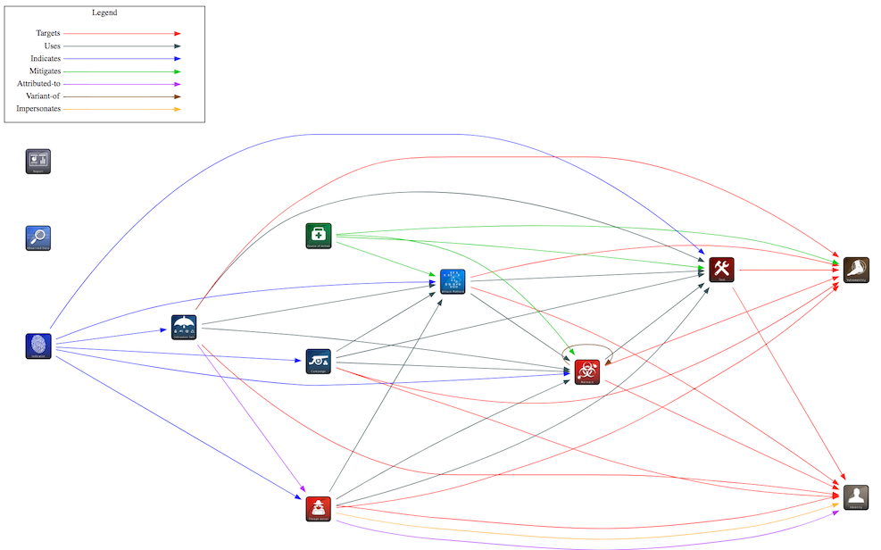

### SDO关系

##### 攻击模式

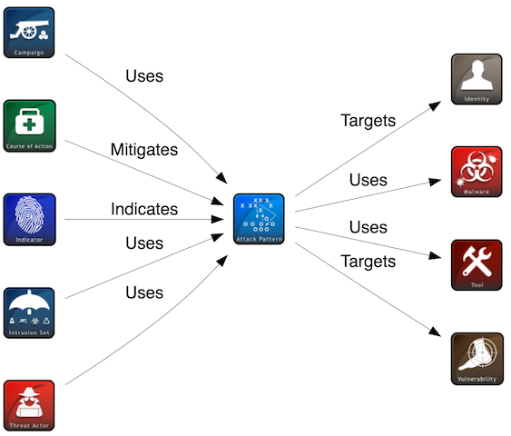

##### 攻击活动

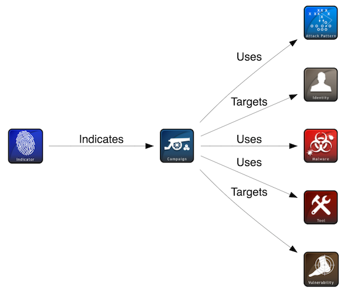

##### 应对措施

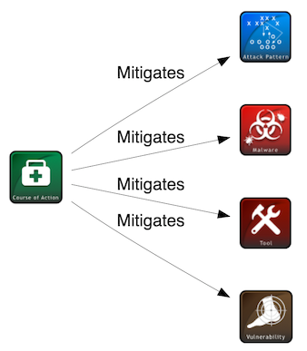

##### 身份

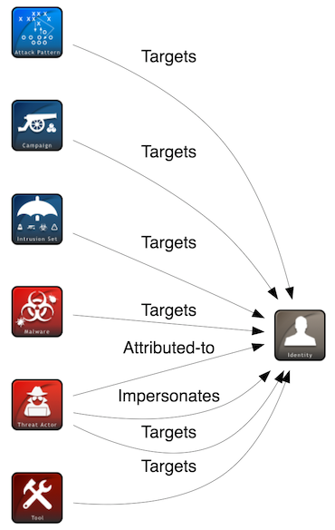

##### 攻击指标

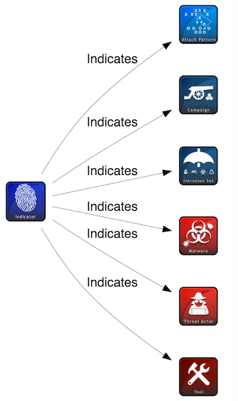

#### 入侵集合

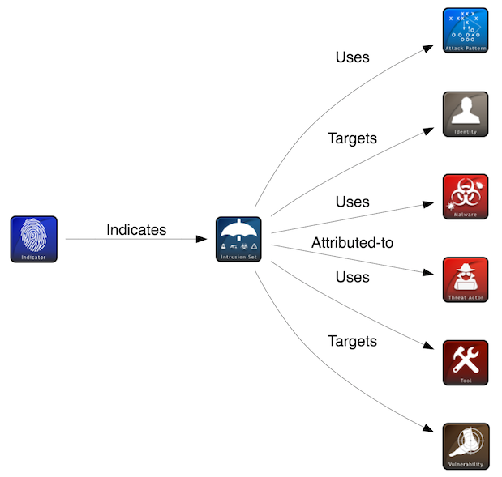

**恶意软件**

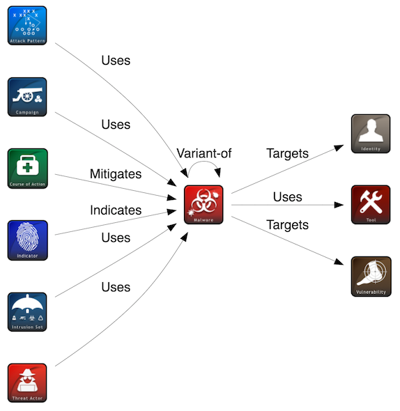

#### 威胁主体

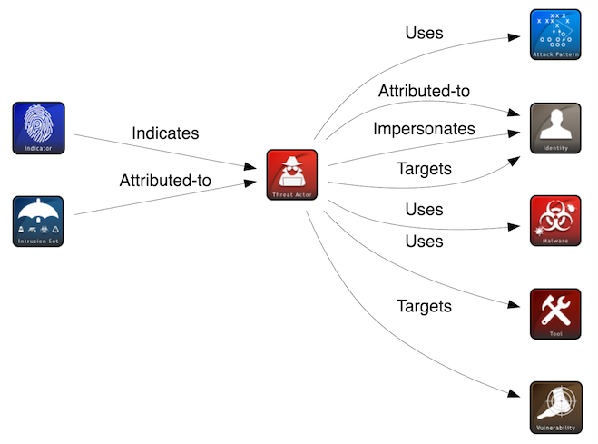

#### 工具

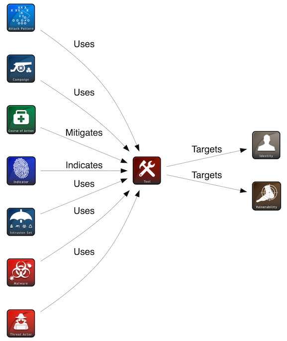

#### 脆弱性

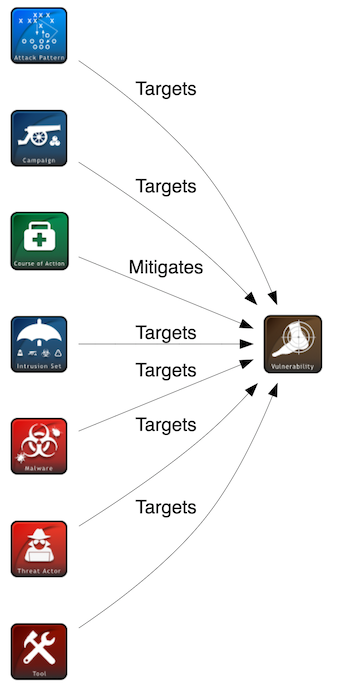