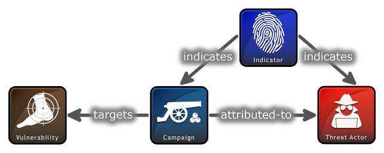

### STIX 2.0的结构

STIX 2的对象用JSON表示，以下是STIX 2.0 的攻击活动对象基于JSON的示例：

```json
{
    "type": "campaign",  
    "id": "campaign--8e2e2d2b-17d4-4cbf-938f-98ee46b3cd3f",  
    "created": "2016-04-06T20:03:00.000Z",  
    "name": "Green Group Attacks Against Finance",  
    "description": "Campaign by Green Group against targets in the financial services sector."  
}
```

STIX 2.0 关系示例如下：



