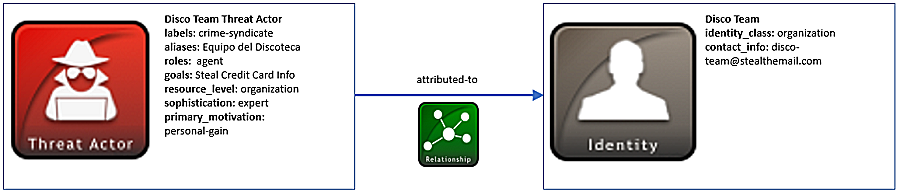

# STIX 2.0 示例概览

以下示例演示了如何将STIX 2.0 概念用于常见用例【2】。它们可用于将多个概念连接在一起，并提供有关STIX对象和属性的更多详细信息

#### 识别威胁主体简介

商业威胁情报提供者和资源充足的政府机构通常将恶意行为溯源到特定威胁主体或威胁主体集团【3】。

#### 场景

在这种场景下，对一个名为“Disco 团队”的威胁主体集团使用STIX威胁主体和身份对象进行建模。Disco 团队主要使用西班牙语来运营，他们以窃取信用卡信息来获取经济利益而闻名，他们公开使用电子邮件别名“disco-team@stealthemail.com”，或者称为“Equipo del Discoteca”

#### 数据模型

正如你所期望的那样，威胁主体识别是使用威胁主体的SDO（STIX字段对象）来表示的。可以在该对象中获取与威胁主体相关的信息，例如目标和动机。其他基本信息不是威胁主体特定的，如联系人信息，最好使用身份SDO来表示。身份对象也可以用于STIX中的威胁主体以外的其他信息。他们可以对组织、政府机构和信息来源等内容进行建模。

需要注意的是，在这种场景下，Disco 团队小组是作为一个威胁主体，而不是入侵集合。他们可能会支持入侵集合，但是这些信息是未知的。一个入侵集合最适合描述包含多个攻击活动和目的的整个攻击集合。在这种情况下，Disco 团队是一个有目的的威胁主体。

**name**（名称）和**labels**（属性）标签是威胁主体SDO所需的唯一必需属性。**labels**字段对于描述Disco 团队是什么类型的威胁主体是至关重要的。因为Disco 团队被认为是大型的、有组织的、利益驱动的窃取财务信息的犯罪团伙，所以，他们最好被标签为**crime-syndicate**（犯罪集团）。

威胁主体SDO还可以为构建更完整的威胁主体简介的可选属性进行建模。例如，**aliases**（别名）字段包含此威胁主体被称为其他名称的列表。威胁主体也可能有一个或多个roles（角色），以更多地描述他们的工作。例如，威胁主体可以赞助或指挥攻击，可以编写恶意软件或者运作恶意的基础设施。在Disco 团队案例中，他们以代理人的身份进行活动运作、发动攻击，进而窃取财务信息。

像大多数威胁主体一样，Disco团队在他们的攻击中有一个特定的目标。因此，**goals**（目标）列表描述了威胁主体想要做什么。在这种情况下，Disco 团队的唯一目标就是窃取信用卡凭证。威胁主体也具有不同程度的专业知识。因此，攻击者的**sophistication**级别（如果知道）可以描述攻击者的技能和知识。由于先进的攻击方法和熟练的工具或恶意代码，Disco 团队被标记为**expert**（专家级）。他们组织的**recource_level**字段表明他们与小规模的个人或团队相比，规模更庞大、资金更充裕。最后，威胁主体通常有一个或多个攻击背后的动机。**primary_motivation**字段描述了发动攻击的主要原因。一些威胁主体可能会寻求恶名或者支配地位，而另一些威胁主体则是为了报复或者个人满足感。对于Disco 团队来说，获取财务信息的动机被归入**personal-gain**动机。

威胁主体的基本身份信息可以使用身份SDO进行建模。对于Disco 团队，他们是一类**organization**（组织），通过**identity_class**字段进行获取。这是由于这种威胁主体更正式、更有组织性，而不是个人黑客或非正式的黑客群体。获取的另一个属性**contact_information**（如果已知身份），表示任何邮件地址或电话号码。对于Disco 团队而言，已经提供了一个邮件地址。

既然Disco 团队的信息是在威胁主体和身份SDO中进行表示，则通过关系SRO将这两个对象连接在一起。在本例中，**source_ref**威胁主体**id**是**attribute-to**到**target_ref**身份id。




##### 实现

```JSON
{
  "type": "bundle",
  "id": "bundle--c9567f73-3803-415c-b06e-2b0622830e5d",
  "spec_version": "2.0",
  "objects": [
    {
      "type": "threat-actor",
      "id": "threat-actor--dfaa8d77-07e2-4e28-b2c8-92e9f7b04428",
      "created": "2014-11-19T23:39:03.893348Z",
      "modified": "2014-11-19T23:39:03.893348Z",
      "name": "Disco Team Threat Actor Group",
      "description": "This organized threat actor group operates to create profit from all types of crime.",
      "labels": [
        "crime-syndicate"
      ],
      "aliases": [
        "Equipo del Discoteca"
      ],
      "roles": [
        "agent"
      ],
      "goals": [
        "Steal Credit Card information"
      ],
      "sophistication": "expert",
      "resource_level": "organization",
      "primary_motivation": "personal-gain"
    },
    {
      "type": "identity",
      "id": "identity--733c5838-34d9-4fbf-949c-62aba761184c",
      "created": "2016-08-23T18:05:49.307000Z",
      "modified": "2016-08-23T18:05:49.307000Z",
      "name": "Disco Team",
      "description": "Disco Team is the name of an organized threat actor crime-syndicate.",
      "identity_class": "organization",
      "contact_information": "disco-team@stealthemail.com"
    },
    {
      "type": "relationship",
      "id": "relationship--966c5838-34d9-4fbf-949c-62aba7611837",
      "created": "2016-08-23T18:05:49.307000Z",
      "modified": "2016-08-23T18:05:49.307000Z",
      "relationship_type": "attributed-to",
      "source_ref": "threat-actor--dfaa8d77-07e2-4e28-b2c8-92e9f7b04428",
      "target_ref": "identity--733c5838-34d9-4fbf-949c-62aba761184c"
    }
  ]
}
```

python生产者

```python
import stix2

threat_actor = stix2.ThreatActor(
    id="threat-actor--dfaa8d77-07e2-4e28-b2c8-92e9f7b04428",
    created="2014-11-19T23:39:03.893Z",
    modified="2014-11-19T23:39:03.893Z",
    name="Disco Team Threat Actor Group",
    description="This organized threat actor group operates to create profit from all types of crime.",
    labels=["crime-syndicate"],
    aliases=["Equipo del Discoteca"],
    roles=["agent"],
    goals=["Steal Credit Card Information"],
    sophistication="expert",
    resource_level="organization",
    primary_motivation="personal-gain"
)


identity = stix2.Identity(
    id="identity--733c5838-34d9-4fbf-949c-62aba761184c",
    created="2016-08-23T18:05:49.307Z",
    modified="2016-08-23T18:05:49.307Z",
    name="Disco Team",
    description="Disco Team is the name of an organized threat actor crime-syndicate.",
    identity_class="organisation",
    contact_information="disco-team@stealthemail.com"
)


relationship = stix2.Relationship(threat_actor, 'attributed-to', identity)


bundle = stix2.Bundle(objects=[threat_actor, identity, relationship])
```

python消费者

```python
import stix2


for obj in bundle.objects:
    if obj == threat_actor:
        print("------------------")
        print("== THREAT ACTOR ==")
        print("------------------")
        print("ID: " + obj.id)
        print("Created: " + str(obj.created))
        print("Modified: " + str(obj.modified))
        print("Name: " + obj.name)
        print("Description: " + obj.description)
        print("Labels: " + obj.labels[0])
        print("Aliases: " + obj.aliases[0])
        print("Goals: " + obj.goals[0])
        print("Sophistication: " + obj.sophistication)
        print("Resource Level: " + obj.resource_level)
        print("Primary Motivation: " + obj.primary_motivation)


    elif obj == identity:
        print("------------------")
        print("== IDENTITY ==")
        print("------------------")
        print("ID: " + obj.id)
        print("Created: " + str(obj.created))
        print("Modified: " + str(obj.modified))
        print("Name: " + obj.name)
        print("Description: " + obj.description)
        print("Identity Class: " + obj.identity_class)
        print("Contact Information: " + obj.contact_information)


    elif obj == relationship:
        print("------------------")
        print("== RELATIONSHIP ==")
        print("------------------")
        print("ID: " + obj.id)
        print("Created: " + str(obj.created))
        print("Modified: " + str(obj.modified))
        print("Relationship Type: " + obj.relationship_type)
        print("Source Ref: " + obj.source_ref)
        print("Target Ref: " + obj.target_ref)
```

