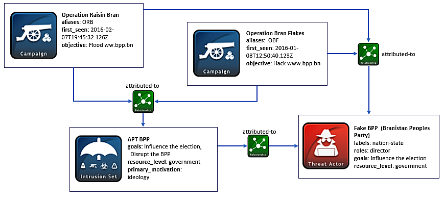
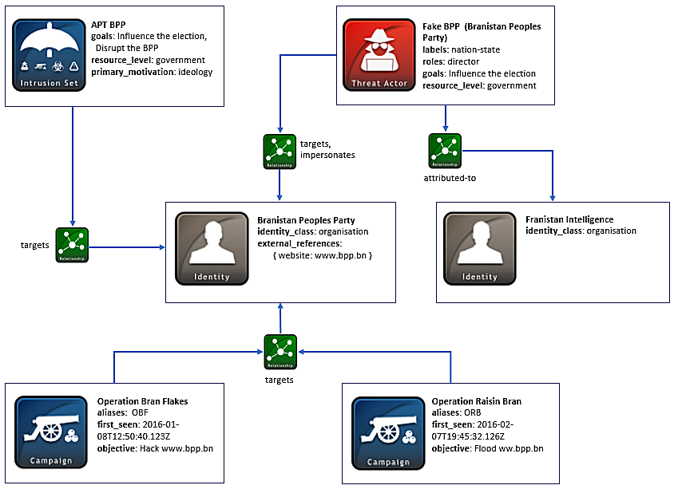
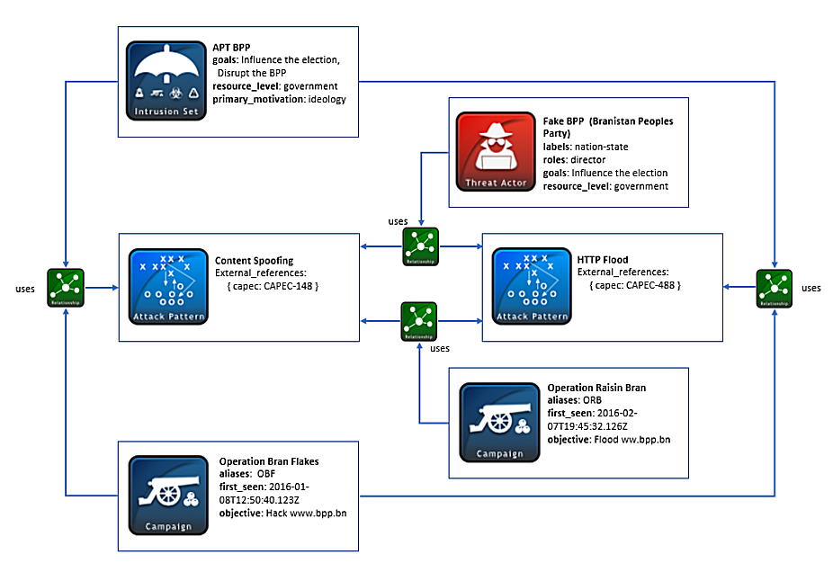

### 定义攻击活动 VS. 威胁主体 VS. 入侵集合

网络攻击经常被威胁主体使用，作为针对特定目标的协同攻击活动的一部分。这些攻击活动通常有一个目标或对象。有时，这些攻击活动是由来自国家级别的、犯罪集团级别的或其他邪恶组织级别的威胁主体策划的，并且包含相似的属性、行为和性质，以便在很长一段时间内实现多个目标，整个攻击包被称为入侵集合.


#### 场景

该场景表示一种怀疑由国家“Franistan”资助的高级持续威胁（APT），攻击目标是BPP（Branistan人民党），BPP是国家Branistan的执政党之一。该入侵集合包括一系列针对BPP网站的复杂攻击活动和攻击模式。其中一项攻击活动的目的是将错误的信息插入到BPP的网页中；另一项攻击活动是针对BPP网络服务器的DDOS攻击。

#### 数据模型

​	首先，使用身份SDO来对Franistan和BPP相关信息进行建模。正如其它STIX示例中提到的（如，识别威胁主体简介），该对象专门用于表示关于Franistan和BPP的共同可识别信息。场景中的身份对象最适合用来帮助使用SRO（STIX 关系对象）建立与其它对象之间的关系。例如，Franistan被归属为一个威胁主体，而BPP是入侵集合和多个攻击活动的目标。

​	接下来，该例子中的高级持续威胁的细节内容在入侵集合SDO中表示。这个被标记name为APT BPP的入侵集合对象包含入侵集合尝试实现的任何动机和目标。goals（目标）属性列表中的APT BPP的一些对象是影响Branistan选举和扰乱BPP。因此，他们的动机是相似的，他们的primary_motivation是意识形态，他们的secondary_motivations是控制权。另外，由于他们被高度怀疑是由Franistan提供资金和资源的资助，他们的resource_level是government（政府），他们的动机和和资源级别的值来自于公开词汇攻击动机和攻击资源级别。

​	与许多入侵集合一样，可能有多个威胁主体（见威胁主体SDO）和攻击活动。在这种场景下，有一个威胁主体简称为假BPP，其目标也是影响Branistan选举。其动机和resource_level也同入侵集合SDO相同，因为该威胁主体已经与此APT关联，所以这是有意义的。假BPP被怀疑由Franistan提供资金资助，这意味着该威胁主体的labels标签是nation-state。其它相关信息可以在roles（角色）和sophistication（复杂度）属性中找到。在该案例中，假BPP是针对Branistan攻击的主导者，因此，其roles（角色）字段将会标记为director。由于他们被认为是资金充裕的先进国家级威胁主体，能够发动APT级别的攻击，假BPP的sophistication（复杂度）级别被认为是战略级。roles（角色）和sophistication（复杂度）的值可以在STIX 2.0规范的开放词汇列表中的威胁主体角色和威胁主体复杂度中找到。

​	作为入侵集合的一部分，一些不同的攻击活动已经与威胁主体联系在一起。这些详细信息可在2个攻击活动SDO中获取。第一个攻击活动称之为Operation Bran Flakes，是由假BPP策划的，目的是黑进BPP网站www.bpp.bn，并在网页中注入虚假信息。第二个报告的攻击活动，名为Operation Raisin Bran，在第一个攻击活动之后发生，尝试对BPP网站实施洪泛攻击，以拒绝合法用户访问该网站。

​	除了在攻击活动对象中对攻击细节进行建模以外，攻击模式SDO还使用CAPEC来对特定攻击进行分类。在这类对象中，你可以在external_references属性下找到对CAPEC ID的引用。例如，尝试插入虚假信息的第一个攻击活动归入external_id CAPEC-148 或“内容欺骗”中。与拒绝服务活动相关的第二个攻击模式SDO引用为external_id CAPEC-488或“HTTP洪泛攻击”。

​	现在我们已经介绍了本示例中的所有STIX字段对象，我们可以检查其中的关系或SRO（STIX关系对象）。在这种场景下，威胁主体、入侵集合和攻击活动使用攻击模式，因此创建多个SRO来表示这些关系。在所有这些关系中，source_ref会引用威胁主体、入侵集合或攻击活动的ID，target_ref将指向本实例中提到的任一攻击模式ID。relationship_type属性将会简单标记为uses。

​	下一个共同关系涉及到BPP的身份SDO。在该案例中，攻击活动、入侵集合和威胁主体都指向这个身份，所以target_ref字段将包括以relationship_type为目标的BPP的身份ID。除了这些关系外，威胁主体假BPP还与其他身份对象之间存在关系。由于假BPP与国家Franistan相关联，因此该威胁主体SDO与Franistan身份SDO通过attributed-to的relationship_type相关联。另外，在前面提到的另一种攻击中，假BPP试图接管真BPP的网站，并在网站发布冒充真BPP的内容，所以需要另一种关系来表示假BPP impersonates（冒充）真BPP。

​	最后，还有更多关系将攻击活动、入侵集合和威胁主体联系在一起，两个攻击活动通过两个独立的attributed-to关系关联到了入侵集合和攻击主体SDO。另外，由于入侵集合表示该攻击主体主导了整个攻击包，入侵集合SDO也通过attributed-to关系关联到了威胁主体。

以下图表有助于在该场景中对SDO之间的关系进行可视化。下面的第一张图用来表示入侵集合、威胁主体和攻击活动对象之间的关联。




第二张图对身份对象、入侵集合、威胁主体和攻击活动SDO之间的关联关系进行建模。




最后，第三张图捕获了攻击模式SDO和入侵集合、威胁主体和攻击活动对象的关系。



##### 实现

```json
{
  "spec_version": "2.0",
  "type": "bundle",
  "id": "bundle--81810123-b298-40f6-a4e7-186efcd07670",
  "objects": [
    {
      "type": "identity",
      "id": "identity--8c6af861-7b20-41ef-9b59-6344fd872a8f",
      "created": "2016-08-08T15:50:10.983Z",
      "modified": "2016-08-08T15:50:10.983Z",
      "name": "Franistan Intelligence",
      "identity_class": "organisation"
    },
    {
      "type": "identity",
      "id": "identity--ddfe7140-2ba4-48e4-b19a-df069432103b",
      "created": "2016-08-08T15:50:10.983Z",
      "modified": "2016-08-08T15:50:10.983Z",
      "external_references": [
        {
          "source_name": "website",
          "url": "http://www.bpp.bn"
        }
      ],
      "name": "Branistan Peoples Party",
      "identity_class": "organisation"
    },
    {
      "type": "threat-actor",
      "id": "threat-actor--56f3f0db-b5d5-431c-ae56-c18f02caf500",
      "created": "2016-08-08T15:50:10.983Z",
      "modified": "2016-08-08T15:50:10.983Z",
      "labels": [
        "nation-state"
      ],
      "roles": [
        "director"
      ],
      "goals": [
        "Influence the election in Branistan"
      ],
      "resource_level": "government",
      "primary_motivation": "ideology",
      "secondary_motivations": [
        "dominance"
      ],
      "name": "Fake BPP (Branistan Peoples Party)",
      "sophistication": "strategic"
    },
    {
      "type": "campaign",
      "id": "campaign--e5268b6e-4931-42f1-b379-87f48eb41b1e",
      "created": "2016-08-08T15:50:10.983Z",
      "modified": "2016-08-08T15:50:10.983Z",
      "name": "Operation Bran Flakes",
      "description": "A concerted effort to insert false information into the BPP's web pages",
      "aliases": [
        "OBF"
      ],
      "first_seen": "2016-01-08T12:50:40.123Z",
      "objective": "Hack www.bpp.bn"
    },
    {
      "type": "campaign",
      "id": "campaign--1d8897a7-fdc2-4e59-afc9-becbe04df727",
      "created": "2016-08-08T15:50:10.983Z",
      "modified": "2016-08-08T15:50:10.983Z",
      "name": "Operation Raisin Bran",
      "description": "A DDOS campaign to flood BPP web servers",
      "aliases": [
        "ORB"
      ],
      "first_seen": "2016-02-07T19:45:32.126Z",
      "objective": "Flood www.bpp.bn"
    },
    {
      "type": "intrusion-set",
      "id": "intrusion-set--ed69450a-f067-4b51-9ba2-c4616b9a6713",
      "created": "2016-08-08T15:50:10.983Z",
      "modified": "2016-08-08T15:50:10.983Z",
      "name": "APT BPP",
      "description": "An advanced persistent threat that seeks to disrupt Branistan's election with multiple attacks",
      "first_seen": "2016-01-08T12:50:40.123Z",
      "resource_level": "government",
      "primary_motivation": "ideology",
      "goals": [
        "Influence the Branistan election",
        "Disrupt the BPP"
      ],
      "secondary_motivations": [
        "dominance"
      ],
      "aliases": [
        "Bran-teaser"
      ]
    },
    {
      "type": "attack-pattern",
      "id": "attack-pattern--19da6e1c-71ab-4c2f-886d-d620d09d3b5a",
      "created": "2016-08-08T15:50:10.983Z",
      "modified": "2017-01-30T21:15:04.127Z",
      "external_references": [
        {
          "external_id": "CAPEC-148",
          "source_name": "capec"
        }
      ],
      "name": "Content Spoofing"
    },
    {
      "type": "attack-pattern",
      "id": "attack-pattern--f6050ea6-a9a3-4524-93ed-c27858d6cb3c",
      "created": "2016-08-08T15:50:10.983Z",
      "modified": "2017-01-30T21:15:04.127Z",
      "external_references": [
        {
          "external_id": "CAPEC-488",
          "source_name": "capec"
        }
      ],
      "name": "HTTP Flood"
    },
    {
      "type": "relationship",
      "id": "relationship--3dcf59c3-30e3-4aa5-9c05-2cbffcee5922",
      "created": "2016-08-08T15:50:10.983Z",
      "modified": "2016-08-08T15:50:10.983Z",
      "relationship_type": "attributed-to",
      "source_ref": "campaign--e5268b6e-4931-42f1-b379-87f48eb41b1e",
      "target_ref": "threat-actor--56f3f0db-b5d5-431c-ae56-c18f02caf500"
    },
    {
      "type": "relationship",
      "id": "relationship--45cd8846-fec5-4e64-8271-3d807dc4ea3b",
      "created": "2016-08-08T15:50:10.983Z",
      "modified": "2016-08-08T15:50:10.983Z",
      "relationship_type": "attributed-to",
      "source_ref": "campaign--1d8897a7-fdc2-4e59-afc9-becbe04df727",
      "target_ref": "threat-actor--56f3f0db-b5d5-431c-ae56-c18f02caf500"
    },
    {
      "type": "relationship",
      "id": "relationship--9b35d9a0-87ae-4800-88fc-f1fc63246c18",
      "created": "2016-08-08T15:50:10.983Z",
      "modified": "2016-08-08T15:50:10.983Z",
      "relationship_type": "attributed-to",
      "source_ref": "campaign--e5268b6e-4931-42f1-b379-87f48eb41b1e",
      "target_ref": "intrusion-set--ed69450a-f067-4b51-9ba2-c4616b9a6713"
    },
    {
      "type": "relationship",
      "id": "relationship--50896dfd-d12f-4376-8b47-26ca4155ed52",
      "created": "2016-08-08T15:50:10.983Z",
      "modified": "2016-08-08T15:50:10.983Z",
      "relationship_type": "attributed-to",
      "source_ref": "campaign--1d8897a7-fdc2-4e59-afc9-becbe04df727",
      "target_ref": "intrusion-set--ed69450a-f067-4b51-9ba2-c4616b9a6713"
    },
    {
      "type": "relationship",
      "id": "relationship--8bd69586-33a6-4dab-99b1-e5728cc3dcd8",
      "created": "2016-08-08T15:50:10.983Z",
      "modified": "2016-08-08T15:50:10.983Z",
      "relationship_type": "attributed-to",
      "source_ref": "intrusion-set--ed69450a-f067-4b51-9ba2-c4616b9a6713",
      "target_ref": "threat-actor--56f3f0db-b5d5-431c-ae56-c18f02caf500"
    },
    {
      "type": "relationship",
      "id": "relationship--11290b55-63e2-40f7-be78-7c32a8c08e68",
      "created": "2016-08-08T15:50:10.983Z",
      "modified": "2016-08-08T15:50:10.983Z",
      "relationship_type": "targets",
      "source_ref": "intrusion-set--ed69450a-f067-4b51-9ba2-c4616b9a6713",
      "target_ref": "identity--ddfe7140-2ba4-48e4-b19a-df069432103b"
    },
    {
      "type": "relationship",
      "id": "relationship--af2a647c-c215-4dc1-af29-19b4aab94f96",
      "created": "2016-08-08T15:50:10.983Z",
      "modified": "2016-08-08T15:50:10.983Z",
      "relationship_type": "uses",
      "source_ref": "intrusion-set--ed69450a-f067-4b51-9ba2-c4616b9a6713",
      "target_ref": "attack-pattern--19da6e1c-71ab-4c2f-886d-d620d09d3b5a"
    },
    {
      "type": "relationship",
      "id": "relationship--98f8012d-a797-43f8-bd59-ed11c078fae0",
      "created": "2016-08-08T15:50:10.983Z",
      "modified": "2016-08-08T15:50:10.983Z",
      "relationship_type": "uses",
      "source_ref": "intrusion-set--ed69450a-f067-4b51-9ba2-c4616b9a6713",
      "target_ref": "attack-pattern--f6050ea6-a9a3-4524-93ed-c27858d6cb3c"
    },
    {
      "type": "relationship",
      "id": "relationship--6b6b524f-f115-4eeb-b488-045d62ddfb66",
      "created": "2016-08-08T15:50:10.983Z",
      "modified": "2016-08-08T15:50:10.983Z",
      "relationship_type": "targets",
      "source_ref": "campaign--e5268b6e-4931-42f1-b379-87f48eb41b1e",
      "target_ref": "identity--ddfe7140-2ba4-48e4-b19a-df069432103b"
    },
    {
      "type": "relationship",
      "id": "relationship--032fb0f6-c1ab-4caf-95aa-25cdd7fb0563",
      "created": "2016-08-08T15:50:10.983Z",
      "modified": "2016-08-08T15:50:10.983Z",
      "relationship_type": "targets",
      "source_ref": "campaign--1d8897a7-fdc2-4e59-afc9-becbe04df727",
      "target_ref": "identity--ddfe7140-2ba4-48e4-b19a-df069432103b"
    },
    {
      "type": "relationship",
      "id": "relationship--1f820ee7-bb30-4d0c-96c8-08e07e08b0ed",
      "created": "2016-08-08T15:50:10.983Z",
      "modified": "2016-08-08T15:50:10.983Z",
      "relationship_type": "uses",
      "source_ref": "campaign--e5268b6e-4931-42f1-b379-87f48eb41b1e",
      "target_ref": "attack-pattern--19da6e1c-71ab-4c2f-886d-d620d09d3b5a"
    },
    {
      "type": "relationship",
      "id": "relationship--addad2d4-f7f1-4d8d-95fb-a94fe084a433",
      "created": "2016-08-08T15:50:10.983Z",
      "modified": "2016-08-08T15:50:10.983Z",
      "relationship_type": "uses",
      "source_ref": "campaign--1d8897a7-fdc2-4e59-afc9-becbe04df727",
      "target_ref": "attack-pattern--f6050ea6-a9a3-4524-93ed-c27858d6cb3c"
    },
    {
      "type": "relationship",
      "id": "relationship--5b271699-d2ad-468c-903d-304ad7a17d71",
      "created": "2016-08-08T15:50:10.983Z",
      "modified": "2016-08-08T15:50:10.983Z",
      "relationship_type": "attributed-to",
      "source_ref": "threat-actor--56f3f0db-b5d5-431c-ae56-c18f02caf500",
      "target_ref": "identity--8c6af861-7b20-41ef-9b59-6344fd872a8f"
    },
    {
      "type": "relationship",
      "id": "relationship--f9d2f337-bf47-40d2-8afd-908d4e366572",
      "created": "2016-08-08T15:50:10.983Z",
      "modified": "2016-08-08T15:50:10.983Z",
      "relationship_type": "impersonates",
      "source_ref": "threat-actor--56f3f0db-b5d5-431c-ae56-c18f02caf500",
      "target_ref": "identity--ddfe7140-2ba4-48e4-b19a-df069432103b"
    },
    {
      "type": "relationship",
      "id": "relationship--51c9484f-e415-4156-a910-613e9f06ba98",
      "created": "2016-08-08T15:50:10.983Z",
      "modified": "2016-08-08T15:50:10.983Z",
      "relationship_type": "targets",
      "source_ref": "threat-actor--56f3f0db-b5d5-431c-ae56-c18f02caf500",
      "target_ref": "identity--ddfe7140-2ba4-48e4-b19a-df069432103b"
    },
    {
      "type": "relationship",
      "id": "relationship--f9d2f337-bf47-40d2-8afd-908d4e366572",
      "created": "2016-08-08T15:50:10.983Z",
      "modified": "2016-08-08T15:50:10.983Z",
      "relationship_type": "uses",
      "source_ref": "threat-actor--56f3f0db-b5d5-431c-ae56-c18f02caf500",
      "target_ref": "attack-pattern--19da6e1c-71ab-4c2f-886d-d620d09d3b5a"
    },
    {
      "type": "relationship",
      "id": "relationship--f9d2f337-bf47-40d2-8afd-908d4e366572",
      "created": "2016-08-08T15:50:10.983Z",
      "modified": "2016-08-08T15:50:10.983Z",
      "relationship_type": "uses",
      "source_ref": "threat-actor--56f3f0db-b5d5-431c-ae56-c18f02caf500",
      "target_ref": "attack-pattern--f6050ea6-a9a3-4524-93ed-c27858d6cb3c"
    }
  ]
}
```

Python生产者

```python
import stix2


threat_actor = stix2.ThreatActor(
    id="threat-actor--56f3f0db-b5d5-431c-ae56-c18f02caf500",
    created="2016-08-08T15:50:10.983Z",
    modified="2016-08-08T15:50:10.983Z",
    name="Fake BPP (Branistan Peoples Party)",
    labels=["nation-state"],
    roles=["director"],
    goals=["Influence the election in Branistan"],
    resource_level="government"
    primary_motivation="ideology",
    secondary_motivations=["dominance"],
    sophistication="strategic"
)


identity1 = stix2.Identity(
    id="identity--8c6af861-7b20-41ef-9b59-6344fd872a8f",
    created="2016-08-08T15:50:10.983Z",
    modified="2016-08-08T15:50:10.983Z",
    name="Franistan Intelligence",
    identity_class="organisation"
)


ref_bpp = stix2.ExternalReference(
    source_name="website",
    url="http://www.bpp.bn"
)


identity2 = stix2.Identity(
    id="identity--ddfe7140-2ba4-48e4-b19a-df069432103b",
    created="2016-08-08T15:50:10.983Z",
    modified="2016-08-08T15:50:10.983Z",
    name="Branistan Peoples Party",
    identity_class="organisation"
    external_references= [ref_bpp]
)


ref_capec1 = stix2.ExternalReference(
    source_name="capec",
    url="https://capec.mitre.org/data/definitions/148.html",
    external_id="CAPEC-148"
)


ref_capec2 = stix2.ExternalReference(
    source_name="capec",
    url="https://capec.mitre.org/data/definitions/488.html",
    external_id="CAPEC-488"
)


attack_pattern1 = stix2.AttackPattern(
    id="attack-pattern--19da6e1c-71ab-4c2f-886d-d620d09d3b5a",
    created="2016-08-08T15:50:10.983Z",
    modified="2017-01-30T21:15:04.127Z",
    name="Content Spoofing",
    external_references=[ref_capec1]
)


attack_pattern2 = stix2.AttackPattern(
    id="attack-pattern--f6050ea6-a9a3-4524-93ed-c27858d6cb3c",
    created="2016-08-08T15:50:10.983Z",
    modified="2017-01-30T21:15:04.127Z",
    name="HTTP Flood",
    external_references=[ref_capec2]
)


campaign1 = stix2.Campaign(
    id="campaign--e5268b6e-4931-42f1-b379-87f48eb41b1e",
    created="2016-08-08T15:50:10.983Z",
    modified="2016-08-08T15:50:10.983Z",
    name="Operation Bran Flakes",
    description="A concerted effort to insert false information into the BPP's web pages.",
    aliases=["OBF"],
    first_seen="2016-01-08T12:50:40.123Z",
    objective="Hack www.bpp.bn"
)


campaign2 = stix2.Campaign(
    id="campaign--1d8897a7-fdc2-4e59-afc9-becbe04df727",
    created="2016-08-08T15:50:10.983Z",
    modified="2016-08-08T15:50:10.983Z",
    name="Operation Raisin Bran",
    description="A DDOS campaign to flood BPP web servers.",
    aliases=["ORB"],
    first_seen="2016-02-07T19:45:32.126Z",
    objective="Flood www.bpp.bn"
)


intrusionset = stix2.IntrusionSet(
    id="intrusion-set--ed69450a-f067-4b51-9ba2-c4616b9a6713",
    created="2016-08-08T15:50:10.983Z",
    modified="2016-08-08T15:50:10.983Z",
    name="APT BPP",
    description="An advanced persistent threat that seeks to disrupt Branistan's election with multiple attacks.",
    first_seen="2016-01-08T12:50:40.123Z",
    resource_level="government",
    primary_motivation="ideology",
    goals=["Influence the Branistan election", "Disrupt the BPP"],
    secondary_motivations=["dominance"],
    aliases=["Bran-teaser"]
)


relationship1 = stix2.Relationship(campaign1, 'attributed-to', threat_actor)
relationship2 = stix2.Relationship(campaign2, 'attributed-to', threat_actor)
relationship3 = stix2.Relationship(campaign1, 'attributed-to', intrusionset)
relationship4 = stix2.Relationship(campaign2, 'attributed-to', intrusionset)
relationship5 = stix2.Relationship(intrusionset, 'attributed-to', threat_actor)
relationship6 = stix2.Relationship(intrusionset, 'targets', identity2)
relationship7 = stix2.Relationship(intrusionset, 'uses', attack_pattern1)
relationship8 = stix2.Relationship(intrusionset, 'uses', attack_pattern2)
relationship9 = stix2.Relationship(campaign1, 'targets', identity2)
relationship10 = stix2.Relationship(campaign2, 'targets', identity2)
relationship11 = stix2.Relationship(campaign1, 'uses', attack_pattern1)
relationship12 = stix2.Relationship(campaign2, 'uses', attack_pattern2)
relationship13 = stix2.Relationship(threat_actor, 'impersonates', identity2)
relationship14 = stix2.Relationship(threat_actor, 'targets', identity2)
relationship15 = stix2.Relationship(threat_actor, 'attributed-to', identity1)
relationship16 = stix2.Relationship(campaign2, 'targets', identity2)
relationship17 = stix2.Relationship(threat_actor, 'uses', attack_pattern1)
relationship18 = stix2.Relationship(threat_actor, 'uses', attack_pattern2)


bundle = stix2.Bundle(objects=[threat_actor, identity1, identity2, attack_pattern1, attack_pattern2, campaign1, campaign2, intrusionset, relationship1, relationship2, relationship3, relationship4, relationship5, relationship6, relationship7, relationship8, relationship9, relationship10, relationship11, relationship12, relationship13, relationship14, relationship15, relationship16, relationship17, relationship18])
```


python消费者

```json
import stix2
import re


for obj in bundle.objects:
    if obj == threat_actor:
        print("------------------")
        print("== THREAT ACTOR ==")
        print("------------------")
        print("ID: " + obj.id)
        print("Created: " + str(obj.created))
        print("Modified: " + str(obj.modified))
        print("Name: " + obj.name)
        print("Labels: " + str(obj.labels))
        print("Roles: " + str(obj.roles))
        print("Goals: " + str(obj.goals))
        print("Resource Level: " + obj.resource_level)
        print("Primary Motivation: " + obj.primary_motivation)
        print("Secondary Motivations: " + str(obj.secondary_motivations))
        print("Sophistication: " + obj.sophistication)


    elif obj == identity1:
        print("------------------")
        print("== IDENTITY ==")
        print("------------------")
        print("ID: " + obj.id)
        print("Created: " + str(obj.created))
        print("Modified: " + str(obj.modified))
        print("Name: " + obj.name)
        print("Identity Class: " + obj.identity_class)


    elif obj == identity2:
        print("------------------")
        print("== IDENTITY ==")
        print("------------------")
        print("ID: " + obj.id)
        print("Created: " + str(obj.created))
        print("Modified: " + str(obj.modified))
        print("Name: " + obj.name)
        print("External References: " + str(obj.external_references))


    elif obj == attack_pattern1:
        print("------------------")
        print("== ATTACK PATTERN ==")
        print("------------------")
        print("ID: " + obj.id)
        print("Created: " + str(obj.created))
        print("Modified: " + str(obj.modified))
        print("Name: " + obj.name)
        print("External References: " + str(obj.external_references))


    elif obj == attack_pattern2:
        print("------------------")
        print("== ATTACK PATTERN ==")
        print("------------------")
        print("ID: " + obj.id)
        print("Created: " + str(obj.created))
        print("Modified: " + str(obj.modified))
        print("Name: " + obj.name)
        print("External References: " + str(obj.external_references))


    elif obj == campaign1:
        print("------------------")
        print("== CAMPAIGN ==")
        print("------------------")
        print("ID: " + obj.id)
        print("Created: " + str(obj.created))
        print("Modified: " + str(obj.modified))
        print("Name: " + obj.name)
        print("Aliases: " + str(obj.aliases))
        print("First Seen: " + str(obj.first_seen))
        print("Objective: " + obj.objective)


    elif obj == campaign2:
        print("------------------")
        print("== CAMPAIGN ==")
        print("------------------")
        print("ID: " + obj.id)
        print("Created: " + str(obj.created))
        print("Modified: " + str(obj.modified))
        print("Name: " + obj.name)
        print("Aliases: " + str(obj.aliases))
        print("First Seen: " + str(obj.first_seen))
        print("Objective: " + obj.objective)


    elif obj == intrusionset:
        print("------------------")
        print("== INTRUSION SET ==")
        print("------------------")
        print("ID: " + obj.id)
        print("Created: " + str(obj.created))
        print("Modified: " + str(obj.modified))
        print("Name: " + obj.name)
        print("Description: " + obj.name)
        print("Resource Level: " + obj.resource_level)
        print("First Seen: " + str(obj.first_seen))
        print("Primary Motivation: " + obj.primary_motivation)
        print("Secondary Motivations: " + str(obj.secondary_motivations))
        print("Aliases: " + str(obj.aliases))
        print("Goals: " + str(obj.goals))


    elif re.search('relationship*', str(obj)):
        print("------------------")
        print("== RELATIONSHIP ==")
        print("------------------")
        print("ID: " + obj.id)
        print("Created: " + str(obj.created))
        print("Modified: " + str(obj.modified))
        print("Relationship Type: " + obj.relationship_type)
        print("Source Ref: " + obj.source_ref)
        print("Target Ref: " + obj.target_ref)
```

