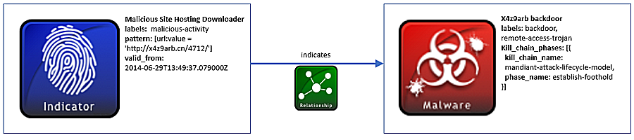

### 恶意URL的攻击指标

将恶意软件投送到潜在目标的一种常见方法是将其托管在特定URL中，然后，目标通过网络钓鱼邮件或另一个网站的链接，被引导到该URL，并在访问URL时被利用。分享恶意URL列表可能是限制暴露恶意代码的一种有效而且便宜的方法【5】。

#### 场景

这种场景包括一个已知是恶意的URL http://x4z9arb.cn/4712/的攻击指标，以及一个与该URL相关的后门恶意软件。该网站已被证明托管这个后门恶意软件，并且已知恶意软件可以下载远程文件。

#### 数据模型

​	恶意URL值只是可以通过使用攻击指标SDO表示的众多攻击指标之一。这是通过使用基于STIX语言模式的攻击指标SDO的pattern（模式）属性来完成的。使用该语言，URL可以使用比对表达式进行构造：[url:value= ‘http://x4z9arb.cn/4712/’]

​	该攻击指标对象还必须包含一个labels（标签）属性，该属性提供有关URL的更多上下文内容信息。已知此场景中的URL是恶意的，因此该攻击指标的标签是malicious-activity，该值取自攻击指标标签开放词汇表，其中包含用于分类攻击指标的其它有用标签。

​	攻击指标对象的另一个必需字段valid_from表明此URL应该被视为有价值的情报。在这种情况下，URL从对象创建开始时就生效。

​	在该场景下，与URL相关的恶意软件是一种后门程序，可以使用STIX恶意软件SDO进行建模。像攻击指标对象一样，恶意软件对象可以使用labels（标签）属性进行分类，标签属性选自恶意软件标签开放词汇表。例如，一个恶意软件可能被分类为键盘记录器、间谍软件、蠕虫、病毒等。在这个例子中，附属在URL的恶意软件是一种backdoor（后门）和remote-access-trojan（远程访问木马）。

​	恶意软件SDO也可以用于捕捉有关恶意软件实例的杀伤链信息。据了解，这款恶意软件试图建立一个后门立足点并下载远程文件。因此，恶意软件对象使用kill_chain_phases列表来表示，该列表既包含所使用的杀伤链的名称，有包含该杀伤链所处的阶段。在这种情况下，Mandiant攻击生命周期模型被用作杀伤链，并包含phase_name的establish-foothold建立点。也可使用其他杀伤链，例如洛克马丁公司或其他组织。

​	最后，关系SDO可以用于连接攻击指标和恶意软件对象。URL攻击指标表明后门恶意软件对象。在该关系中，攻击指标id是source_ref，恶意软件id是target_ref。

以下关系图表示了攻击指标和恶意软件SDO，以及它们之间关系SRO



##### 实现

```json
{
  "type": "bundle",
  "id": "bundle--44af6c39-c09b-49c5-9de2-394224b04982",
  "spec_version": "2.0",
  "objects": [
    {
      "type": "indicator",
      "id": "indicator--d81f86b9-975b-bc0b-775e-810c5ad45a4f",
      "created": "2014-06-29T13:49:37.079000Z",
      "modified": "2014-06-29T13:49:37.079000Z",
      "labels": [
        "malicious-activity"
      ],
      "name": "Malicious site hosting downloader",
      "pattern": "[url:value = 'http://x4z9arb.cn/4712/']",
      "valid_from": "2014-06-29T13:49:37.079000Z"
    },
    {
      "type": "malware",
      "id": "malware--162d917e-766f-4611-b5d6-652791454fca",
      "created": "2014-06-30T09:15:17.182Z",
      "modified": "2014-06-30T09:15:17.182Z",
      "name": "x4z9arb backdoor",
      "labels": [
        "backdoor",
        "remote-access-trojan"
      ],
      "description": "This malware attempts to download remote files after establishing a foothold as a backdoor.",
      "kill_chain_phases": [
        {
          "kill_chain_name": "mandiant-attack-lifecycle-model",
          "phase_name": "establish-foothold"
        }
      ]
    },
    {
      "type": "relationship",
      "id": "relationship--6ce78886-1027-4800-9301-40c274fd472f",
      "created": "2014-06-30T09:15:17.182Z",
      "modified": "2014-06-30T09:15:17.182Z",
      "relationship_type": "indicates",
      "source_ref": "indicator--d81f86b9-975b-bc0b-775e-810c5ad45a4f",
      "target_ref": "malware--162d917e-766f-4611-b5d6-652791454fca"
    }
  ]
}
```

python生产者

```python
import stix2


indicator = stix2.Indicator(
    id="indicator--d81f86b9-975b-bc0b-775e-810c5ad45a4f",
    created="2014-06-29T13:49:37.079Z",
    modified="2014-06-29T13:49:37.079Z",
    name="Malicious site hosting downloader",
    description="This organized threat actor group operates to create profit from all types of crime.",
    labels=["malicious-activity"],
    pattern="[url:value = 'http://x4z9arb.cn/4712/']",
    valid_from="2014-06-29T13:49:37.079000Z"
)


foothold = stix2.KillChainPhase(
    kill_chain_name="mandiant-attack-lifecycle-model",
    phase_name="establish-foothold"
)


malware = stix2.Malware(
    id="malware--162d917e-766f-4611-b5d6-652791454fca",
    created="2014-06-30T09:15:17.182Z",
    modified="2014-06-30T09:15:17.182Z",
    name="x4z9arb backdoor",
    labels=["backdoor", "remote-access-trojan"],
    description="This malware attempts to download remote files after establishing a foothold as a backdoor.",
    kill_chain_phases=[foothold]
)


relationship = stix2.Relationship(indicator, 'indicates', malware)

bundle = stix2.Bundle(objects=[indicator, malware, relationship])
```


python消费者

```python
import stix2


for obj in bundle.objects:
    if obj == malware:
        print("------------------")
        print("== MALWARE ==")
        print("------------------")
        print("ID: " + obj.id)
        print("Created: " + str(obj.created))
        print("Modified: " + str(obj.modified))
        print("Name: " + obj.name)
        print("Description: " + obj.description)
        print("Labels: " + obj.labels[0] + ", " + obj.labels[1])
        print("Kill Chain: " + str(obj.kill_chain_phases))


    elif obj == indicator:
        print("------------------")
        print("== INDICATOR ==")
        print("------------------")
        print("ID: " + obj.id)
        print("Created: " + str(obj.created))
        print("Modified: " + str(obj.modified))
        print("Name: " + obj.name)
        print("Description: " + obj.description)
        print("Labels: " + obj.labels[0])
        print("Pattern: " + obj.pattern)
        print("Valid From: " + str(obj.valid_from))


    elif obj == relationship:
        print("------------------")
        print("== RELATIONSHIP ==")
        print("------------------")
        print("ID: " + obj.id)
        print("Created: " + str(obj.created))
        print("Modified: " + str(obj.modified))
        print("Relationship Type: " + obj.relationship_type)
        print("Source Ref: " + obj.source_ref)
        print("Target Ref: " + obj.target_ref)
```

