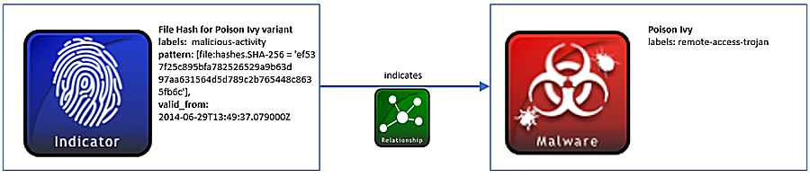

## 文件哈希的恶意软件攻击指标

常用的威胁情报共享方式是共享基于主机的恶意代码攻击指标，这些恶意代码通常是文件名和哈希值。本示例描述了文件哈希攻击指标，恶意代码的名字和类型

### 场景

该场景由一个简单的攻击指标的描述组成，该攻击指标表示一个给定哈希文件和上下文内容信息的模式，如果发现具有该哈希值的文件，这可能表示可能存在Poison Ivy的样本。

### 数据模型

攻击指标SDO用于对表达式模式进行建模，例如本示例中的Posion Ivy文件哈希。该哈希表示使用基于STIX模式语言的攻击指标对象的**pattern**（模式）属性，通过该语言，SHA-256哈希的比较表达式如下：[file:hashes.’SHA-256’= ‘ef537f25c895bfa782526529a9b63d97aa631564d5d789c2b765448c8635fb6c’]。如果已知，则可以表示其他文件属性，例如，名称或路径。另外，虽然本示例只涉及文件哈希，许多其他网络可观测数据对象和它们的属性可以使用攻击指标模式进行建模。例如，邮件信息、域名、IP地址和进程等。

攻击指标对象还需要一个**labels**（标签）属性，它有助于定义正在表示的攻击指标类型。在该场景中，哈希值与Poison Ivy（一种已知恶意类型的恶意样本）相关联，所以该攻击指标被标记为**malicious-activity**（恶意活动）。该值取自攻击指标标签开放词汇表，其中提供了用于分类指标的其他有用标签。

接下来，**Poison Ivy**恶意软件的详细信息可以使用STIX恶意软件对象进行捕获。STIX中恶意软件对象还包含特定恶意软件类型所需的labels（标签）属性。在这种情况下，Poison Ivy是一个**remote-access-trojan**。该词汇选自恶意软件标签开放词汇表，其中包含多种常见类型的恶意软件类别，例如病毒、后门、间谍软件等。

这些SDO通过关系SRO耦合在一起。此关系将**source_ref**攻击指标和**target_ref**恶意软件通过指示**relationship_type**进行关联。

以下关系图表示了攻击指标和恶意软件SDO以及关系SRO之间的关联关系：



#### 实现

```json
{
  "type": "bundle",
  "id": "bundle--44af6c39-c09b-49c5-9de2-394224b04982",
  "spec_version": "2.0",
  "objects": [
    {
      "type": "indicator",
      "id": "indicator--a932fcc6-e032-176c-126f-cb970a5a1ade",
      "created": "2014-02-20T09:16:08.989000Z",
      "modified": "2014-02-20T09:16:08.989000Z",
      "name": "File hash for Poison Ivy variant",
      "description": "This file hash indicates that a sample of Poison Ivy is present.",
      "labels": [
        "malicious-activity"
      ],
      "pattern": "[file:hashes.'SHA-256' = 'ef537f25c895bfa782526529a9b63d97aa631564d5d789c2b765448c8635fb6c']",
      "valid_from": "2014-02-20T09:00:00.000000Z"
    },
    {
      "type": "malware",
      "id": "malware--fdd60b30-b67c-11e3-b0b9-f01faf20d111",
      "created": "2014-02-20T09:16:08.989000Z",
      "modified": "2014-02-20T09:16:08.989000Z",
      "name": "Poison Ivy",
      "labels": [
        "remote-access-trojan"
      ]
    },
    {
      "type": "relationship",
      "id": "relationship--f191e70e-1736-47c3-b0f9-fdfe01387eb1",
      "created": "2014-02-20T09:16:08.989000Z",
      "modified": "2014-02-20T09:16:08.989000Z",
      "relationship_type": "indicates",
      "source_ref": "indicator--a932fcc6-e032-176c-126f-cb970a5a1ade",
      "target_ref": "malware--fdd60b30-b67c-11e3-b0b9-f01faf20d111"
    }
  ]
}
```


Python 生产者

```python
import stix2

indicator = stix2.Indicator(
    id="indicator--a932fcc6-e032-176c-126f-cb970a5a1ade",
    created="2014-02-20T09:16:08.989Z",
    modified="2014-02-20T09:16:08.989Z",
    name="File hash for Poison Ivy variant",
    description="This file hash indicates that a sample of Poison Ivy is present.",
    labels=["malicious-activity"],
    pattern="[file:hashes.'SHA-256' = 'ef537f25c895bfa782526529a9b63d97aa631564d5d789c2b765448c8635fb6c']",
    valid_from="2014-02-20T09:00:00.000000Z"
)

malware = stix2.Malware(
    id="malware--fdd60b30-b67c-11e3-b0b9-f01faf20d111",
    created="2014-02-20T09:16:08.989Z",
    modified="2014-02-20T09:16:08.989Z",
    name="Poison Ivy",
    labels=["remote-access-trojan"]
)

relationship = stix2.Relationship(indicator, 'indicates', malware)
bundle = stix2.Bundle(objects=[indicator, malware, relationship])
```


Python 消费者

```python
import stix2

for obj in bundle.objects:
    if obj == malware:
        print("------------------")
        print("== MALWARE ==")
        print("------------------")
        print("ID: " + obj.id)
        print("Created: " + str(obj.created))
        print("Modified: " + str(obj.modified))
        print("Name: " + obj.name)
        print("Labels: " + obj.labels[0])

    elif obj == indicator:
        print("------------------")
        print("== INDICATOR ==")
        print("------------------")
        print("ID: " + obj.id)
        print("Created: " + str(obj.created))
        print("Modified: " + str(obj.modified))
        print("Name: " + obj.name)
        print("Description: " + obj.description)
        print("Labels: " + obj.labels[0])
        print("Pattern: " + obj.pattern)
        print("Valid From: " + str(obj.valid_from))

    elif obj == relationship:
        print("------------------")
        print("== RELATIONSHIP ==")
        print("------------------")
        print("ID: " + obj.id)
        print("Created: " + str(obj.created))
        print("Modified: " + str(obj.modified))
        print("Relationship Type: " + obj.relationship_type)
        print("Source Ref: " + obj.source_ref)
        print("Target Ref: " + obj.target_ref)
```


