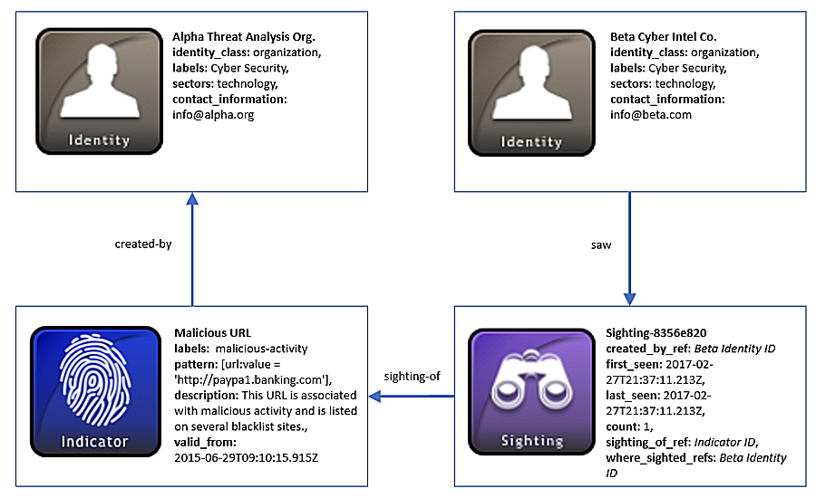

## 攻击指标的瞄准

网络威胁情报共享和协作的一个主要好处是能够在该攻击指标出现在系统或网络之前，提前给其它公司和机构发出告警。这为解决网络威胁问题提供了更主动的方法。在许多情况下，一个攻击指标会在多个网络中出现。可以分享这个在其它地方看到的特定攻击指标，对于其它也使用此类威胁情报的组织至关重要.

### 场景

该场景包括两个威胁共享威胁情报的网络安全公司Alpha和Beta。在Alpha的网络上看到一个恶意URL，并且生成了一个攻击指标来捕获这些信息。Alpha公司然后与B公司分享这些信息，Beta公司后来在他们的系统中发现了这个攻击指标，然后，Beta公司会创建并分享该攻击指标的瞄准，表示该攻击指标已经被发现。

### 数据模型

在该案例中，有两个身份SDO用于两个公司：Alpha和Bwta。身份对象记录关于两个组织的相关信息，例如他们是哪个行业、他们的工作以及联系方式。两个组织都是STIX情报的生产者和消费者，所以他们的**id**可以在使用**created_by_ref**属性的对象中引用，以表明他们是生成STIX对象的创建人。值得注意的是，身份SDO也可以用来表示个人、攻击对象、政府机构、团体等。

身份对象至少需要一些必需的属性：**name**和**identity_class**。identity_class字段对于Alpha和Beta代表的身份类型的分类很重要，在他们的案例中，该字段被值organization填充。该术语来自于身份类型开放词汇表，其中包含了标签身份的建议值。

身份SDO的其它字段是可选的，有助于帮助构建完整的身份简介。例如，了解个人或团体的角色列表可能很有用，该列表使用**labels**（标签）属性进行捕捉。由于这个场景中两家公司都使用处置网络威胁，因此将他们标记为**cyber security**（网络安全）是有意义的。如果你了解身份可能属于**sectors**（行业）列表或任何相关的**contact_information**，这也可以为这些对象提供此信息。例如，知道某些STIX对象创建者在金融行业，则可能会提供更多的背景知识，来说明为什么他们发现某些攻击指标或成为特定威胁主体的目标。例子中的两个公司都在技术行业，这些词汇来自与行业开放词汇表。

接下来，Alpha公司使用攻击指标SDO来捕获他们在他们网络中发现的恶意URL信息。使用STIX模式语言，Alpha在**pattern**（模式）属性中将URL表示为比较表达式：[url:value = ‘http://paypa1.banking.com’]。由于Alpha知道该URL是恶意的，他们在labels字段将其标记为**malicious-activity**，该字段来自于攻击指标标签开放词汇表。

Beta公司从Alpha公司接收到这个攻击指标情报，并在自己的网络上部署它，用于发现该特定URL。一旦发现它们，他们就会生成瞄准SRO，这是一种与常规关系SRO不同的特殊类型的关系对象。例如，瞄准包含的**count**、**first_seen**和**last_seen**等唯一字段，用于表示在特定时间内看到SDO的时间，以及此SDO出现的次数。另外，一个标准关系SRO仅用于将两个SDO连接在一起，而不提供相同情报类型的认定。

在该案例中，Beta的瞄准对象捕获了关于A的攻击指标相关信息，这些信息被B在他们的网络中发现。由于在这个案例中，他们是该对象的创建者和受害者，B的身份ID在**created_by_ref**和**where_sighted_refs**属性中进行表示。值得一提的是，**where_sighted_refs**字段是一个列表，所以它可以列出发现的其它身份SDO ID的位置。另一个引用中，**sighting_of_ref**包含瞄准SDO的ID，在这种情况下是攻击指标对象。这是一个必需的属性，因为没有一个“瞄准”对象的话，就没有瞄准属性。

在某些情况下，像URL的攻击指标可以在一段时间内在网络上发现多次。但是，对于这种情况，Beta只发现一次URL，最后**count**（计数）字段标记为整数“1”。因为只看到了它一次，**first_seen**和**last_seen**属性描述了相同的时间戳。

以下关系图表示表示身份、身份SDO和瞄准SRO：



### 实现

```json
{
  "type": "bundle",
  "id": "bundle--c6a895f2-849c-4d1b-aba4-4b45c2800374",
  "spec_version": "2.0",
  "objects": [
    {
      "type": "identity",
      "id": "identity--39012926-a052-44c4-ae48-caaf4a10ee6e",
      "created": "2017-02-24T15:50:10.564Z",
      "modified": "2017-08-24T15:50:10.564Z",
      "name": "Alpha Threat Analysis Org.",
      "identity_class": "organization",
      "labels": [
        "Cyber Security"
      ],
      "sectors": [
        "technology"
      ],
      "contact_information": "info@alpha.org"
    },
    {
      "type": "identity",
      "id": "identity--5206ba14-478f-4b0b-9a48-395f690c20a2",
      "created": "2017-02-26T17:55:10.442Z",
      "modified": "2017-02-26T17:55:10.442Z",
      "name": "Beta Cyber Intelligence Company",
      "identity_class": "organization",
      "labels": [
        "Cyber Security"
      ],
      "sectors": [
        "technology"
      ],
      "contact_information": "info@beta.com"
    },
    {
      "type": "indicator",
      "id": "indicator--9299f726-ce06-492e-8472-2b52ccb53191",
      "created_by_ref": "identity--39012926-a052-44c4-ae48-caaf4a10ee6e",
      "created": "2017-02-27T13:57:10.515Z",
      "modified": "2017-02-27T13:57:10.515Z",
      "name": "Malicious URL",
      "description": "This URL is potentially associated with malicious activity and is listed on several blacklist sites.",
      "pattern": "[url:value = 'http://paypa1.banking.com']",
      "valid_from": "2015-06-29T09:10:15.915Z",
      "labels": [
        "malicious-activity"
      ]
    },
    {
      "type": "sighting",
      "id": "sighting--8356e820-8080-4692-aa91-ecbe94006833",
      "created_by_ref": "identity--5206ba14-478f-4b0b-9a48-395f690c20a2",
      "created": "2017-02-28T19:37:11.213Z",
      "modified": "2017-02-28T19:37:11.213Z",
      "first_seen": "2017-02-27T21:37:11.213Z",
      "last_seen": "2017-02-27T21:37:11.213Z",
      "count": 1,
      "sighting_of_ref": "indicator--9299f726-ce06-492e-8472-2b52ccb53191",
      "where_sighted_refs": [
        "identity--5206ba14-478f-4b0b-9a48-395f690c20a2"
      ]
    }
  ]
}

```

#### Python生产者

```python
import stix2


identityAlpha = stix2.Identity(
    id="identity--39012926-a052-44c4-ae48-caaf4a10ee6e",
    created="2017-02-24T15:50:10.564Z",
    modified="2017-02-24T15:50:10.564Z",
    name="Alpha Threat Analysis Org.",
    identity_class="organisation",
    contact_information="info@alpha.org",
    labels=["Cyber Security"],
    sectors=["technology"]
)


identityBeta = stix2.Identity(
    id="identity--5206ba14-478f-4b0b-9a48-395f690c20a2",
    created="2017-02-26T17:55:10.442Z",
    modified="2017-02-26T17:55:10.442Z",
    name="Beta Cyber Intelligence Company",
    identity_class="organisation",
    contact_information="info@beta.com",
    labels=["Cyber Security"],
    sectors=["technology"]
)


indicator = stix2.Indicator(
    id="indicator--9299f726-ce06-492e-8472-2b52ccb53191",
    created_by_ref="identity--39012926-a052-44c4-ae48-caaf4a10ee6e",
    created="2017-02-27T13:57:10.515Z",
    modified="2017-02-27T13:57:10.515Z",
    name="Malicious URL",
    description="This URL is potentially associated with malicious activity and is listed on several blacklist sites.",
    labels=["malicious-activity"],
    pattern="[url:value = 'http://paypa1.banking.com']",
    valid_from="2015-06-29T09:10:15.915Z"
)


sighting = stix2.Sighting(
    id="sighting--8356e820-8080-4692-aa91-ecbe94006833",
    created_by_ref="identity--5206ba14-478f-4b0b-9a48-395f690c20a2",
    created="2017-02-28T19:37:11.213Z",
    modified="2017-02-28T19:37:11.213Z",
    first_seen="2017-02-27T21:37:11.213Z",
    last_seen="2017-02-27T21:37:11.213Z",
    count=1,
    sighting_of_ref="indicator--9299f726-ce06-492e-8472-2b52ccb53191",
    where_sighted_refs=["identity--5206ba14-478f-4b0b-9a48-395f690c20a2"]
)


bundle = stix2.Bundle(objects=[indicator, identityAlpha, identityBeta, sighting])

```

#### python消费者

```python
import stix2


for obj in bundle.objects:
    if obj == identityAlpha:
        print("------------------")
        print("== IDENTITY ==")
        print("------------------")
        print("ID: " + obj.id)
        print("Created: " + str(obj.created))
        print("Modified: " + str(obj.modified))
        print("Name: " + obj.name)
        print("Identity Class: " + obj.identity_class)
        print("Contact Information: " + obj.contact_information)
        print("Labels: " + obj.labels[0])
        print("Sectors: " + obj.sectors[0])


    elif obj == identityBeta:
        print("------------------")
        print("== IDENTITY ==")
        print("------------------")
        print("ID: " + obj.id)
        print("Created: " + str(obj.created))
        print("Modified: " + str(obj.modified))
        print("Name: " + obj.name)
        print("Identity Class: " + obj.identity_class)
        print("Contact Information: " + obj.contact_information)
        print("Labels: " + obj.labels[0])
        print("Sectors: " + obj.sectors[0])


    elif obj == indicator:
        print("------------------")
        print("== INDICATOR ==")
        print("------------------")
        print("ID: " + obj.id)
        print("Created: " + str(obj.created))
        print("Modified: " + str(obj.modified))
        print("Created by Ref: " + obj.created_by_ref)
        print("Name: " + obj.name)
        print("Description: " + obj.description)
        print("Labels: " + obj.labels[0])
        print("Pattern: " + obj.pattern)
        print("Valid From: " + str(obj.valid_from))


    elif obj == sighting:
        print("------------------")
        print("== SIGHTING ==")
        print("------------------")
        print("ID: " + obj.id)
        print("Created: " + str(obj.created))
        print("Modified: " + str(obj.modified))
        print("Created by Ref: " + obj.created_by_ref)
        print("First Seen: " + str(obj.first_seen))
        print("Last Seen: " + str(obj.last_seen))
        print("Count: " + str(obj.count))
        print("Sighting of Ref: " + obj.sighting_of_ref)
        print("Where Sighted Refs: " + obj.where_sighted_refs[0])

```

