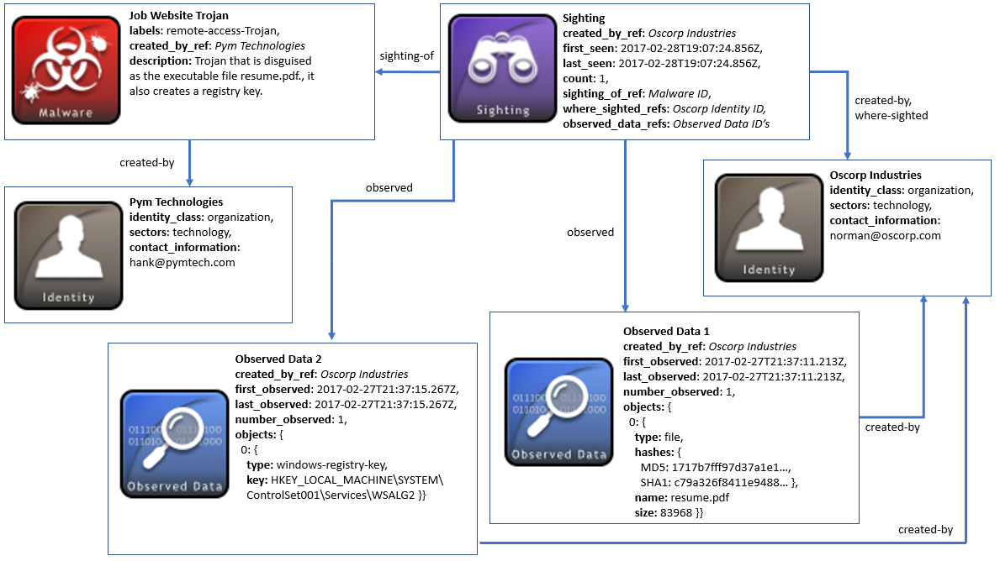

## 可观测数据的瞄准

虽然攻陷的攻击指标表示攻击背后的情报认定，但原始可观测数据有助于构建该威胁情报背后的基础。在许多情况下，分享可观测数据对组织来说是有好处的。与攻击指标类似，瞄准可以包括可观测数据对象的引用：在其它组织的网络中观察到该可观测数据，就可以表示有关某种恶意软件的信息。这可能潜在地允许基于这个瞄准的原始数据来对情报做更深层次的认定【8】。

### 场景

该场景由两个网络威胁公司Pym和Oscorp组成，他们彼此共享威胁情报。Pym公司最早与Oscorp公司共享恶意软件SDO。Oscorp公司后来认为，他们已经根据一些捕获到的可观测数据，在他们自己的网络上发现了恶意软件对象。这些数据包含了匹配恶意软件哈希和恶意软件创建的注册表键值。为了表示这一点，Oscorp发布了一个瞄准SRO，该对象包含这些可观测数据的引用，基于此可以成为一个该特定恶意软件的瞄准。

### 数据模型

在该案例中，两个公司使用两个身份SDO：Pym和Oscorp。身份对象记录了这两个组织的相关信息，例如他们在那个行业以及相关的联系信息。这两个组织都是STIX情报的生产者和消费者，所以他们的**id**可以在使用**created_by_ref**属性的对象中引用，以表明他们是他们生成的STIX对象的创建者。值得注意的是，身份SDO也可以用来表示个人、攻击目标、政府机构和团体等等。

身份对象至少需要一些必需的属性：**name**和**identity_class**。identity_class字段对于将**Pym**和**Oscorp**标识的类型进行分类很重要。在该案例中标识为**organization**（组织）。此值来自于身份类别开放词汇表，其中包含标识身份的建议值。

Pym首先创建了恶意软件SDO，用来表示该场景中有关恶意软件类型的详细信息。这种特定恶意软件类型被标记为**remote-access-trojan**，并且伪装成可以创建多个注册表键值的pdf文件。Pym将该情报向Oscorp进行了分享。

拥有该恶意软件对象的Oscorp，相信已经在他的网络中发现了该恶意软件，并且已经创建了一个瞄准对象来表示。瞄准SRO是一种特殊类型的STIX关系，其中包含所见对象的属性，如恶意软件SDO的**id**（具有**sighting_of_ref**）、表示该恶意软件被发现次数的**count**（计数值）属性，以及首次发现和最后发现的时间戳。此外，还包括可观测数据列表，用以表达任何可能支持该恶意软件瞄准相关的必要信息。

可观测数据SDO包含在系统和网络中捕获的网络可观测数据信息，包括IP地址、文件和URL。在该场景中，Oscorp观察到文件和注册表键值的信息，他们使用两个不同的可观测数据对象进行建模。尽管你可以在可观测数据案例中包含多个网络可观测数据对象，在这种情况下，文件和注册表键值数据不直接相关。因此，它们包含在单独的可观测数据中。你可以分别阅读STIX 2.0 规范第3部分和第4部分涵盖的STIX网络可观测数据的概念和对象内容。

除了所有对象的通用属性外，可观测数据的属性都是必需的。因此，对于每一个对象，Oscorp必须提供每个案例的**first_observed**、**last_observed**以及**number_observed**（发现的次数）。另外，他们需要在objects（对象属性）中提供实际的网络可观测对象。本示例中的第一个可观测数据（下图中的Observed Data 1）包含有关所看到的文件的信息。因此，使用包含哈希列表、文件名称和大小等数据来表示文件。在第二个可观测数据对象中，Oscorp对Windows注册表键值进行建模，例如可疑的恶意软件创建的注册表键值。

最后，值得一提的是，在这种情况下，没有一个对象使用通常将一个对象和另一个对象进行关联的标准关系SRO。瞄准SRO用于恶意软件对象的瞄准，下图中的所有其它关系都被嵌套在这些对象中，例如，瞄准对象包含几个嵌入式关系，包括观测到的内容、谁创建的对象以及在哪里看到的。

下图描述了这种场景：



### 实现

```json
{
  "type": "bundle",
  "id": "bundle--a836f05a-f235-4b4b-b523-bd87e40478a1",
  "spec_version": "2.0",
  "objects": [
    {
      "type": "identity",
      "id": "identity--987eeee1-413a-44ac-96cc-0a8acdcc2f2c",
      "created": "2017-04-14T13:07:49.812Z",
      "modified": "2017-04-14T13:07:49.812Z",
      "name": "Oscorp Industries",
      "identity_class": "organization",
      "contact_information": "norman@oscorp.com",
      "sectors": [
        "technology"
      ]
    },
    {
      "type": "identity",
      "id": "identity--7865b6d2-a4af-45c5-b582-afe5ec376c33",
      "created": "2017-04-14T13:07:49.812Z",
      "modified": "2017-04-14T13:07:49.812Z",
      "name": "Pym Technologies",
      "identity_class": "organization",
      "contact_information": "hank@pymtech.com",
      "sectors": [
        "technology"
      ]
    },
    {
      "type": "malware",
      "id": "malware--ae560258-a5cb-4be8-8f05-013d6712295f",
      "created_by_ref": "identity--7865b6d2-a4af-45c5-b582-afe5ec376c33",
      "created": "2014-02-20T09:16:08.989000Z",
      "modified": "2014-02-20T09:16:08.989000Z",
      "name": "Online Job Site Trojan",
      "description": "Trojan that is disguised as the executable file resume.pdf., it also creates a registry key.",
      "labels": [
        "remote-access-trojan"
      ]
    },
    {
      "type": "sighting",
      "id": "sighting--779c4ae8-e134-4180-baa4-03141095d971",
      "created_by_ref": "identity--987eeee1-413a-44ac-96cc-0a8acdcc2f2c",
      "created": "2017-02-28T19:37:11.213Z",
      "modified": "2017-02-28T19:37:11.213Z",
      "first_seen": "2017-02-28T19:07:24.856Z",
      "last_seen": "2017-02-28T19:07:24.856Z",
      "count": 1,
      "sighting_of_ref": "malware--ae560258-a5cb-4be8-8f05-013d6712295f",
      "where_sighted_refs": [
        "identity--987eeee1-413a-44ac-96cc-0a8acdcc2f2c"
      ],
      "observed_data_refs": [
        "observed-data--cf8eaa41-6f4c-482e-89b9-9cd2d6a83cb1",
        "observed-data--a0d34360-66ad-4977-b255-d9e1080421c4"
      ]
    },
    {
      "type": "observed-data",
      "id": "observed-data--cf8eaa41-6f4c-482e-89b9-9cd2d6a83cb1",
      "created_by_ref": "identity--987eeee1-413a-44ac-96cc-0a8acdcc2f2c",
      "created": "2017-02-28T19:37:11.213Z",
      "modified": "2017-02-28T19:37:11.213Z",
      "first_observed": "2017-02-27T21:37:11.213Z",
      "last_observed": "2017-02-27T21:37:11.213Z",
      "number_observed": 1,
      "objects": {
        "0": {
          "type": "file",
          "hashes": {
            "MD5": "1717b7fff97d37a1e1a0029d83492de1",
            "SHA-1": "c79a326f8411e9488bdc3779753e1e3489aaedea"
          },
          "name": "resume.pdf",
          "size": 83968
        }
      }
    },
    {
      "type": "observed-data",
      "id": "observed-data--a0d34360-66ad-4977-b255-d9e1080421c4",
      "created_by_ref": "identity--987eeee1-413a-44ac-96cc-0a8acdcc2f2c",
      "created": "2017-02-28T19:37:11.213Z",
      "modified": "2017-02-28T19:37:11.213Z",
      "first_observed": "2017-02-27T21:37:11.213Z",
      "last_observed": "2017-02-27T21:37:11.213Z",
      "number_observed": 1,
      "objects": {
        "0": {
          "type": "windows-registry-key",
          "key": "HKEY_LOCAL_MACHINE\\SYSTEM\\ControlSet001\\Services\\WSALG2"
        }
      }
    }
  ]
}

```

#### Python生产者

```python
import stix2


identityOscorp = stix2.Identity(
    id="identity--987eeee1-413a-44ac-96cc-0a8acdcc2f2c",
    created="2017-04-14T13:07:49.812Z",
    modified="2017-04-14T13:07:49.812Z",
    name="Oscorp Industries",
    identity_class="organisation",
    contact_information="norman@oscorp.com",
    sectors=["technology"]
)


identityPym = stix2.Identity(
    id="identity--7865b6d2-a4af-45c5-b582-afe5ec376c33",
    created="2017-04-14T13:07:49.812Z",
    modified="2017-04-14T13:07:49.812Z",
    name="Pym Technologies",
    identity_class="organisation",
    contact_information="hank@pymtech.com",
    sectors=["technology"]
)


malware = stix2.Malware(
    id="malware--ae560258-a5cb-4be8-8f05-013d6712295f",
    created="2014-02-20T09:16:08.989Z",
    modified="2014-02-20T09:16:08.989Z",
    created_by_ref="identity--7865b6d2-a4af-45c5-b582-afe5ec376c33",
    name="Online Job Site Trojan",
    description="Trojan that is disguised as the executable file resume.pdf., it also creates a registry key.",
    labels=["remote-access-trojan"]
)


observedDataFile = stix2.ObservedData(
    id="observed-data--cf8eaa41-6f4c-482e-89b9-9cd2d6a83cb1",
    created="2017-02-28T19:37:11.213Z",
    modified="2017-02-28T19:37:11.213Z",
    first_observed="2017-02-27T21:37:11.213Z",
    last_observed="2017-02-27T21:37:11.213Z",
    number_observed=1,
    created_by_ref="identity--7865b6d2-a4af-45c5-b582-afe5ec376c33",
    objects={
        "0": {
            "type": "file",
            "hashes": {
                "MD5": "1717b7fff97d37a1e1a0029d83492de1",
                "SHA-1": "c79a326f8411e9488bdc3779753e1e3489aaedea"
            },
            "name": "resume.pdf",
            "size": 83968
        }
    }
)

observedDataRegKey = stix2.ObservedData(
    id="observed-data--a0d34360-66ad-4977-b255-d9e1080421c4",
    created="2017-02-28T19:37:11.213Z",
    modified="2017-02-28T19:37:11.213Z",
    first_observed="2017-02-27T21:37:11.213Z",
    last_observed="2017-02-27T21:37:11.213Z",
    number_observed=1,
    created_by_ref="identity--7865b6d2-a4af-45c5-b582-afe5ec376c33",
    objects={
        "0": {
            "type": "windows-registry-key",
            "key": "HKEY_LOCAL_MACHINE\\SYSTEM\\ControlSet001\\Services\\WSALG2"
        }
    }
)

sighting = stix2.Sighting(
    id="sighting--779c4ae8-e134-4180-baa4-03141095d971",
    created_by_ref="identity--987eeee1-413a-44ac-96cc-0a8acdcc2f2c",
    created="2017-02-28T19:37:11.213Z",
    modified="2017-02-28T19:37:11.213Z",
    first_seen="2017-02-28T19:07:24.856Z",
    last_seen="2017-02-28T19:07:24.856Z",
    count=1,
    sighting_of_ref="malware--ae560258-a5cb-4be8-8f05-013d6712295f",
    where_sighted_refs=["identity--987eeee1-413a-44ac-96cc-0a8acdcc2f2c"],
    observed_data_refs=["observed-data--cf8eaa41-6f4c-482e-89b9-9cd2d6a83cb1", "observed-data--a0d34360-66ad-4977-b255-d9e1080421c4"]
)

bundle = stix2.Bundle(objects=[identityPym, identityOscorp, malware, observedDataFile, observedDataRegKey, sighting])
```

#### Python消费者

```python
import stix2


for obj in bundle.objects:
    if obj == identityPym:
        print("------------------")
        print("== IDENTITY ==")
        print("------------------")
        print("ID: " + obj.id)
        print("Created: " + str(obj.created))
        print("Modified: " + str(obj.modified))
        print("Name: " + obj.name)
        print("Identity Class: " + obj.identity_class)
        print("Contact Information: " + obj.contact_information)
        print("Sectors: " + obj.sectors[0])


    elif obj == identityOscorp:
        print("------------------")
        print("== IDENTITY ==")
        print("------------------")
        print("ID: " + obj.id)
        print("Created: " + str(obj.created))
        print("Modified: " + str(obj.modified))
        print("Name: " + obj.name)
        print("Identity Class: " + obj.identity_class)
        print("Contact Information: " + obj.contact_information)
        print("Sectors: " + obj.sectors[0])


    elif obj == malware:
        print("------------------")
        print("== MALWARE ==")
        print("------------------")
        print("ID: " + obj.id)
        print("Created: " + str(obj.created))
        print("Modified: " + str(obj.modified))
        print("Created by Ref: " + obj.created_by_ref)
        print("Name: " + obj.name)
        print("Description: " + obj.description)
        print("Labels: " + obj.labels[0])


    elif obj == observedDataFile:
        print("------------------")
        print("== OBSERVED DATA ==")
        print("------------------")
        print("ID: " + obj.id)
        print("Created: " + str(obj.created))
        print("Modified: " + str(obj.modified))
        print("Created by Ref: " + obj.created_by_ref)
        print("First Observed: " + str(obj.first_observed))
        print("Last Observed: " + str(obj.last_observed))
        print("Number Observed: " + str(obj.number_observed))
        print("Objects: " + str(obj.objects))


    elif obj == observedDataRegKey:
        print("------------------")
        print("== OBSERVED DATA ==")
        print("------------------")
        print("ID: " + obj.id)
        print("Created: " + str(obj.created))
        print("Modified: " + str(obj.modified))
        print("Created by Ref: " + obj.created_by_ref)
        print("First Observed: " + str(obj.first_observed))
        print("Last Observed: " + str(obj.last_observed))
        print("Number Observed: " + str(obj.number_observed))
        print("Objects: " + str(obj.objects))


    elif obj == sighting:
        print("------------------")
        print("== SIGHTING ==")
        print("------------------")
        print("ID: " + obj.id)
        print("Created: " + str(obj.created))
        print("Modified: " + str(obj.modified))
        print("Created by Ref: " + obj.created_by_ref)
        print("First Seen: " + str(obj.first_seen))
        print("Last Seen: " + str(obj.last_seen))
        print("Count: " + str(obj.count))
        print("Sighting of Ref: " + obj.sighting_of_ref)
        print("Where Sighted Refs: " + obj.where_sighted_refs[0])
```


