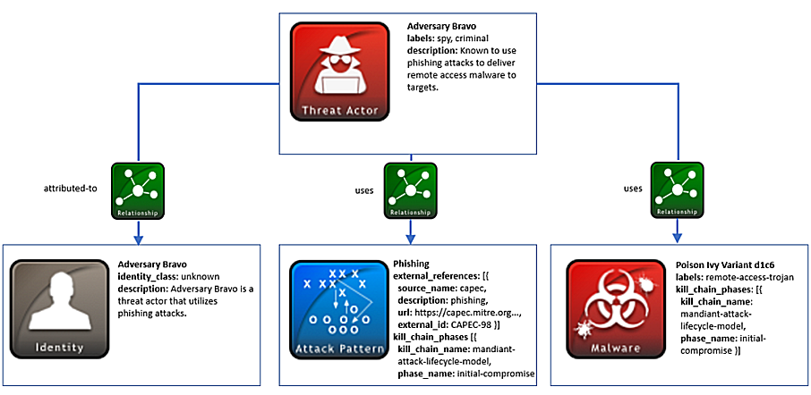

## 威胁主体利用攻击模式和恶意软件

对威胁主体进行溯源和关联的很大一部分原因是为了更好地理解敌方行为，以确定应对措施并防御这类攻击。在很多情况下，敌方行为可以通过他们使用的攻击模式的类型来表征。例如，作为恶意软件的一种投递机制，使用鱼叉式网络钓鱼是一种攻击模式。在其它情况下，可以根据敌方通常使用的恶意软件来描述行为。

### 场景

这个场景表示一个被为“Adversary Bravo”的威胁主体，已知敌方Adversary Bravo使用钓鱼攻击来向目标投递远程访问的恶意软件。他们通常使用的是Poison Ivy恶意软件的变种。

### 数据模型

​	敌方Bravo的任何已知特征和属性都可以使用威胁主体SDO进行建模。该对象捕捉威胁主体的特定信息，例如其它别名、攻击动机、攻击中他们可能扮演的角色。有时候，这些信息并不完全清楚，敌方Bravo就是这种情况。因此，你只需要指定威胁主体对象的必需属性，包含**name**（名称）和**labels**（标签）列表。**labels**（标签）字段根据开放词汇**threat-actor-label-ov**对威胁主体的类型进行分类。在这种情况下，我们可以推断，通过使用Poison Ivy恶意软件建立远程后门，敌方Bravo可能会执行恶意活动或间谍活动，从而会产生**criminal**（犯罪）和**spy**（间谍）标签。

​	有关敌方Bravo的其它基本标识信息是通过身份SDO获取的。在该场景下，此对象用于威胁主体的身份，但它也可以代表组织、政府和其它主体。这对于获取此身份可能所属的行业以及相关的联系信息很有用。在敌方Bravo案例中，关于这个身份的信息很少，所以基于身份类别开放列表所需的**identity_class**属性可能是未知的。身份SDO可以通过使用关系对象与威胁主体SDO进行连接。这两个对象之间的关系类型（由**relationship_type**字段表示）将包含**attributed-to**值，这意味着该威胁主体归属于此身份。

​	该场景中的恶意软件是Poison Ivy的变种d1c6，可以使用一个恶意软件SDO来表示。每个恶意软件对象都需要包含一系列标签来描述恶意软件。由于这是一种远程木马，因此**labels**（标签）属性将包含来自恶意软件标签开放词汇表的值**remote-access-trojan**。另外，你可以使用多个值标记恶意软件对象，因为有些恶意软件可能具有多个功能。例如，特定类型的恶意软件可能同时是键盘记录器和间谍软件。另一种关系可能在恶意软件SDO和威胁主体SDO之间建立。在这种情况下，两个对象之间使用**relationship_type**，威胁主体使用这个恶意软件。

​	敌方Bravo使用网络钓鱼作为恶意软件Poison Ivy的一种投递机制，这可以使用攻击模式SDO来表示。除了提供更多关于攻击主体想要做什么的上下文信息外，攻击模式对象对于表示分类很有用，例如CAPEC的**external_references**字段。CAPEC是潜在攻击模式的字典，所以在这种情况下，通过查看该字典，生产者可以看到“CAPEC-98”是网络钓鱼的ID，并且可以标记为**external_id**。关系SRO再次使用**relationship_type**将威胁主体连接到此次攻击模式对象。

​	在恶意软件和攻击模式对象中可以看到的另一个有用的概念是获取杀伤链信息的能力。例如，一旦系统受到攻击，某些攻击模式、恶意软件和工具可能用于建立立足点或横向移动。在这个例子中，由于攻击主体试图用Poison Ivy变种建立一个初级后门，Poison Ivy恶意软件和网络钓鱼攻击模式与杀伤链阶段**initial-compromise**相关。此阶段来自于Mandiant攻击生命周期模型，但你不限于使用任何指定类型的杀伤链。

下图显示了此场景中使用的对象：




### 实现

```json
{
  "type": "bundle",
  "id": "bundle--44af6c39-c09b-49c5-9de2-394224b04982",
  "spec_version": "2.0",
  "objects": [
    {
      "type": "attack-pattern",
      "id": "attack-pattern--8ac90ff3-ecf8-4835-95b8-6aea6a623df5",
      "created": "2015-05-07T14:22:14.760144Z",
      "modified": "2015-05-07T14:22:14.760144Z",
      "name": "Phishing",
      "description": "Spear phishing used as a delivery mechanism for malware.",
      "external_references": [
        {
          "source_name": "capec",
          "description": "phishing",
          "url": "https://capec.mitre.org/data/definitions/98.html",
          "external_id": "CAPEC-98"
        }
      ],
      "kill_chain_phases": [
        {
          "kill_chain_name": "mandiant-attack-lifecycle-model",
          "phase_name": "initial-compromise"
        }
      ]
    },
    {
      "type": "identity",
      "id": "identity--1621d4d4-b67d-11e3-9670-f01faf20d111",
      "created": "2015-05-10T16:27:17.760123Z",
      "modified": "2015-05-10T16:27:17.760123Z",
      "name": "Adversary Bravo",
      "description": "Adversary Bravo is a threat actor that utilizes phishing attacks",
      "identity_class": "unknown"
    },
    {
      "type": "threat-actor",
      "id": "threat-actor--9a8a0d25-7636-429b-a99e-b2a73cd0f11f",
      "created": "2015-05-07T14:22:14.760144Z",
      "modified": "2015-05-07T14:22:14.760144Z",
      "name": "Adversary Bravo",
      "description": "Adversary Bravo is known to use phishing attacks to deliver remote access malware to the targets.",
      "labels": [
        "spy",
        "criminal"
      ]
    },
    {
      "type": "malware",
      "id": "malware--d1c612bc-146f-4b65-b7b0-9a54a14150a4",
      "created": "2015-04-23T11:12:34.760122Z",
      "modified": "2015-04-23T11:12:34.760122Z",
      "name": "Poison Ivy Variant d1c6",
      "labels": [
        "remote-access-trojan"
      ],
      "kill_chain_phases": [
        {
          "kill_chain_name": "mandiant-attack-lifecycle-model",
          "phase_name": "initial-compromise"
        }
      ]
    },
    {
      "type": "relationship",
      "id": "relationship--ad4bccee-1ed3-44f5-9a56-8085584d3360",
      "created": "2015-05-07T14:22:14.760144Z",
      "modified": "2015-05-07T14:22:14.760144Z",
      "relationship_type": "uses",
      "source_ref": "threat-actor--9a8a0d25-7636-429b-a99e-b2a73cd0f11f",
      "target_ref": "malware--d1c612bc-146f-4b65-b7b0-9a54a14150a4"
    },
    {
      "type": "relationship",
      "id": "relationship--e05a50c3-a557-4d5f-ac19-e3f0859171cc",
      "created": "2015-05-07T14:22:14.760144Z",
      "modified": "2015-05-07T14:22:14.760144Z",
      "relationship_type": "uses",
      "source_ref": "threat-actor--9a8a0d25-7636-429b-a99e-b2a73cd0f11f",
      "target_ref": "attack-pattern--8ac90ff3-ecf8-4835-95b8-6aea6a623df5"
    },
    {
      "type": "relationship",
      "id": "relationship--bdcef81d-9dfa-4f5d-a7e5-7ab13b695495",
      "created": "2015-05-07T14:22:14.760144Z",
      "modified": "2015-05-07T14:22:14.760144Z",
      "relationship_type": "attributed-to",
      "source_ref": "threat-actor--9a8a0d25-7636-429b-a99e-b2a73cd0f11f",
      "target_ref": "identity--1621d4d4-b67d-11e3-9670-f01faf20d111"
    }
  ]
}
```

#### Python 生产者

```python
import stix2


threat_actor = stix2.ThreatActor(
    id="threat-actor--9a8a0d25-7636-429b-a99e-b2a73cd0f11f",
    created="2015-05-07T14:22:14.760Z",
    modified="2015-05-07T14:22:14.760Z",
    name="Adversary Bravo",
    description="Adversary Bravo is known to use phishing attacks to deliver remote access malware to the targets.",
    labels=["spy", "criminal"]
)


identity = stix2.Identity(
    id="identity--1621d4d4-b67d-11e3-9670-f01faf20d111",
    created="2015-05-10T16:27:17.760Z",
    modified="2015-05-10T16:27:17.760Z",
    name="Adversary Bravo",
    description="Adversary Bravo is a threat actor that utilizes phishing attacks.",
    identity_class="unknown"
)


init_comp = stix2.KillChainPhase(
    kill_chain_name="mandiant-attack-lifecycle-model",
    phase_name="initial-compromise"
)


malware = stix2.Malware(
    id="malware--d1c612bc-146f-4b65-b7b0-9a54a14150a4",
    created="2015-04-23T11:12:34.760Z",
    modified="2015-04-23T11:12:34.760Z",
    name="Poison Ivy Variant d1c6",
    labels=["remote-access-trojan"],
    kill_chain_phases=[init_comp]
)


ref = stix2.ExternalReference(
    source_name="capec",
    description="phishing",
    url="https://capec.mitre.org/data/definitions/98.html",
    external_id="CAPEC-98"
)


attack_pattern = stix2.AttackPattern(
    id="attack-pattern--8ac90ff3-ecf8-4835-95b8-6aea6a623df5",
    created="2015-05-07T14:22:14.760Z",
    modified="2015-05-07T14:22:14.760Z",
    name="Phishing",
    description="Spear phishing used as a delivery mechanism for malware.",
    kill_chain_phases=[init_comp],
    external_references=[ref]
)


relationship1 = stix2.Relationship(threat_actor, 'uses', malware)
relationship2 = stix2.Relationship(threat_actor, 'uses', attack_pattern)
relationship3 = stix2.Relationship(threat_actor, 'attributed-to', identity)


bundle = stix2.Bundle(objects=[threat_actor, malware, attack_pattern, identity, relationship1, relationship2, relationship3])

```

#### Python 消费者

```python
import stix2


for obj in bundle.objects:
    if obj == threat_actor:
        print("------------------")
        print("== THREAT ACTOR ==")
        print("------------------")
        print("ID: " + obj.id)
        print("Created: " + str(obj.created))
        print("Modified: " + str(obj.modified))
        print("Name: " + obj.name)
        print("Description: " + obj.description)
        print("Labels: " + obj.labels[0] + ", " + obj.labels[1])


    elif obj == identity:
        print("------------------")
        print("== IDENTITY ==")
        print("------------------")
        print("ID: " + obj.id)
        print("Created: " + str(obj.created))
        print("Modified: " + str(obj.modified))
        print("Name: " + obj.name)
        print("Description: " + obj.description)
        print("Identity Class: " + obj.identity_class)


    elif obj == malware:
        print("------------------")
        print("== MALWARE ==")
        print("------------------")
        print("ID: " + obj.id)
        print("Created: " + str(obj.created))
        print("Modified: " + str(obj.modified))
        print("Name: " + obj.name)
        print("Labels: " + obj.labels[0])
        print("Kill Chain: " + str(obj.kill_chain_phases))


    elif obj == attack_pattern:
        print("------------------")
        print("== ATTACK PATTERN ==")
        print("------------------")
        print("ID: " + obj.id)
        print("Created: " + str(obj.created))
        print("Modified: " + str(obj.modified))
        print("Name: " + obj.name)
        print("Description: " + obj.description)
        print("Kill Chain: " + str(obj.kill_chain_phases))
        print("External References: " + str(obj.external_references))


    elif obj == relationship1:
        print("------------------")
        print("== RELATIONSHIP ==")
        print("------------------")
        print("ID: " + obj.id)
        print("Created: " + str(obj.created))
        print("Modified: " + str(obj.modified))
        print("Relationship Type: " + obj.relationship_type)
        print("Source Ref: " + obj.source_ref)
        print("Target Ref: " + obj.target_ref)


    elif obj == relationship2:
        print("------------------")
        print("== RELATIONSHIP ==")
        print("------------------")
        print("ID: " + obj.id)
        print("Created: " + str(obj.created))
        print("Modified: " + str(obj.modified))
        print("Relationship Type: " + obj.relationship_type)
        print("Source Ref: " + obj.source_ref)
        print("Target Ref: " + obj.target_ref)


    elif obj == relationship3:
        print("------------------")
        print("== RELATIONSHIP ==")
        print("------------------")
        print("ID: " + obj.id)
        print("Created: " + str(obj.created))
        print("Modified: " + str(obj.modified))
        print("Relationship Type: " + obj.relationship_type)
        print("Source Ref: " + obj.source_ref)
        print("Target Ref: " + obj.target_ref)
```

